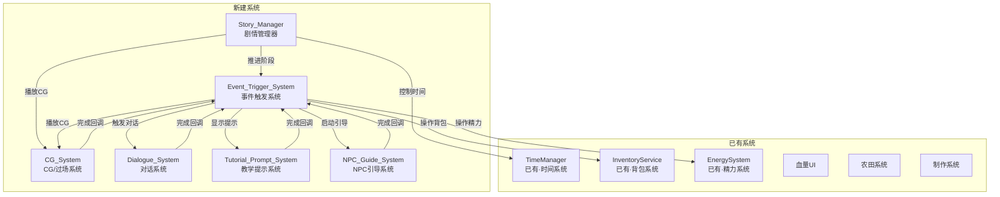
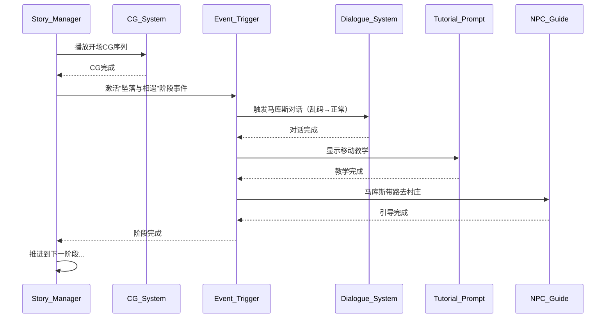

# 设计文档：春1日剧情实现

## 概述

春1日剧情实现需要搭建5个新管线系统（对话系统、事件触发系统、CG/过场系统、教学提示系统、NPC引导系统），加上一个顶层剧情管理器（Story_Manager）将它们与已有系统（农田、精力、血量、制作、时间、物品）串联起来，驱动春1日从开场CG到睡觉结束的完整剧情流程。

设计原则：
- 数据驱动：对话内容、事件序列、触发条件等全部以 ScriptableObject 配置，修改剧情不改代码
- 最小可用：每个系统只做"能跑春1日"所需的功能，不过度抽象
- 兼容已有：通过项目已有的 `EventBus` 发布/订阅机制与现有系统通信，不侵入已有代码
- 遵循项目惯例：单例模式（如 `EnergySystem.Instance`）、`Sunset.Events` 命名空间、`IGameEvent` 接口

## 架构

### 系统间关系图



### 通信方式

系统间通信采用两种方式：

1. **EventBus 事件**（松耦合）：用于系统间广播通知，如剧情阶段变化、教学步骤完成等。新增事件定义在 `StoryEvents.cs` 中，遵循已有的 `IGameEvent` 接口。

2. **直接引用 + 回调**（紧耦合但简单）：Story_Manager 直接持有各子系统引用，通过 `Action` 回调获知子系统任务完成。这比纯事件更直观，适合剧情这种强顺序依赖的场景。

### 执行流程概览




## 组件与接口

### 1. Story_Manager（剧情管理器）

**文件**：`Assets/YYY_Scripts/Story/StoryManager.cs`

**职责**：管理春1日整体剧情流程，按固定顺序推进剧情阶段，协调各子系统。

**关键设计**：
- 单例模式（`StoryManager.Instance`），挂载在场景持久化对象上
- 内部维护一个 `StoryPhase` 枚举表示当前阶段
- 每个阶段对应一个方法，阶段完成后自动调用下一阶段
- 持有剧情变量字典 `Dictionary<string, bool>`，如 `languageDecoded`、`healthBarVisible` 等
- 脚本化阶段（开场CG到17:00）控制 `TimeManager` 暂停/设置时间；自由时段恢复正常时间流逝

**关键接口**：

```csharp
public class StoryManager : MonoBehaviour
{
    public static StoryManager Instance { get; private set; }
    
    // 剧情阶段枚举
    public enum StoryPhase
    {
        None,
        OpeningCG,           // 开场CG
        CrashAndMeet,        // 14:00 坠落与相遇
        EnterVillage,        // 14:20 初入村庄
        HealingAndHP,        // 14:30 疗伤与血条
        WorkbenchFlashback,  // 14:45 工作台与闪回
        FarmingTutorial,     // 15:10 耕种教学
        DinnerConflict,      // 16:00 晚餐与冲突
        ReturnAndReminder,   // 17:00 归途与夜间提醒
        FreeTime,            // 自由时段
        DayEnd               // 睡觉结束
    }
    
    public StoryPhase CurrentPhase { get; private set; }
    
    // 剧情变量
    public bool GetFlag(string key);
    public void SetFlag(string key, bool value);
    
    // 阶段推进
    public void AdvanceToNextPhase();
    
    // 子系统引用（Inspector 拖拽赋值）
    [SerializeField] private DialogueManager dialogueManager;
    [SerializeField] private CGManager cgManager;
    [SerializeField] private TutorialPromptManager tutorialManager;
    [SerializeField] private NPCGuideManager npcGuideManager;
}
```

### 2. Dialogue_System（对话系统）

**文件**：`Assets/YYY_Scripts/Story/Dialogue/DialogueManager.cs`

**职责**：显示对话框、逐字打字、头像切换、内心独白样式、气泡对话。

**关键设计**：
- 对话数据从 `DialogueSequenceSO` 读取，包含对话节点列表
- 打字机效果：协程逐字显示，可配置速度（字/秒）
- 按确认键：正在打字→立即显示完整文本；已显示完整→推进下一句
- 对话开始时通过 `EventBus` 发布 `DialogueStartEvent`，PlayerMovement 监听后停止移动
- 对话结束时发布 `DialogueEndEvent`，恢复玩家控制
- 内心独白：对话节点中 `isInnerMonologue = true` 时使用斜体+不同颜色
- 气泡对话：独立的 `BubbleDialogue` 组件挂在NPC头顶，不锁定玩家

**关键接口**：

```csharp
public class DialogueManager : MonoBehaviour
{
    // 播放一段对话序列，完成后回调
    public void PlayDialogue(DialogueSequenceSO sequence, Action onComplete);
    
    // 显示NPC头顶气泡文本
    public void ShowBubble(string npcId, string text, float duration);
    
    // 是否正在播放对话
    public bool IsDialoguePlaying { get; }
}
```

### 3. CG_System（CG/过场系统）

**文件**：`Assets/YYY_Scripts/Story/CG/CGManager.cs`

**职责**：播放开场CG序列、黑屏淡入淡出、文字叠加、屏幕震动、画面模糊。

**关键设计**：
- CG序列数据从 `CGSequenceSO` 读取，包含步骤列表（每步：背景图、文字、音效、停留时间、特效类型）
- 使用 Canvas 上的全屏 `Image`（背景图）+ `CanvasGroup`（淡入淡出）+ `TextMeshProUGUI`（文字）
- 屏幕震动：通过 Cinemachine Impulse 或简单的 Camera 位移协程实现
- 画面模糊：通过 URP 后处理 Volume 的 Depth of Field 参数控制
- 场景过渡：黑屏淡出→加载/移动→黑屏淡入，复用同一套淡入淡出逻辑

**关键接口**：

```csharp
public class CGManager : MonoBehaviour
{
    // 播放CG序列，完成后回调
    public void PlayCGSequence(CGSequenceSO sequence, Action onComplete);
    
    // 场景过渡（黑屏淡出→执行动作→黑屏淡入）
    public void DoTransition(float fadeOutTime, Action onBlack, float fadeInTime, Action onComplete);
    
    // 单独控制
    public void FadeToBlack(float duration, Action onComplete = null);
    public void FadeFromBlack(float duration, Action onComplete = null);
    public void ShowText(string text, float fadeInTime);
    public void HideText(float fadeOutTime);
    public void ShakeScreen(float intensity, float duration);
    public void SetBlur(bool enabled, float transitionTime = 0.3f);
}
```

### 4. Event_Trigger_System（事件触发系统）

**文件**：`Assets/YYY_Scripts/Story/Events/StoryEventTrigger.cs`

**职责**：根据位置、交互、条件、事件链触发剧情事件，执行关联的动作序列。

**关键设计**：
- 每个触发器是场景中的一个 `GameObject`，挂载 `StoryEventTrigger` 组件
- 触发类型通过枚举区分：`Location`（Collider2D 触发区域）、`Interaction`（玩家按E）、`Condition`（变量满足条件）、`Chain`（前置事件完成后自动触发）
- 位置触发使用 `OnTriggerEnter2D`，检测玩家 Collider 进入
- 动作序列从 `StoryActionListSO` 读取，支持的动作类型：播放对话、播放CG、显示教学提示、启动NPC引导、设置剧情变量、添加物品到背包、修改精力/血量、等待时间
- 每个触发器可配置"仅触发一次"（`triggerOnce = true`）
- 前置条件：检查 `StoryManager.GetFlag()` 是否满足

**关键接口**：

```csharp
public class StoryEventTrigger : MonoBehaviour
{
    [SerializeField] private TriggerType triggerType;
    [SerializeField] private StoryActionListSO actionList;
    [SerializeField] private bool triggerOnce = true;
    [SerializeField] private string requiredFlag; // 前置条件
    [SerializeField] private bool requiredFlagValue = true;
    
    public enum TriggerType { Location, Interaction, Condition, Chain }
}
```

**动作执行器**：`StoryActionRunner.cs` 负责按顺序执行动作列表中的每个动作，每个动作完成后执行下一个。

```csharp
public class StoryActionRunner : MonoBehaviour
{
    public void RunActions(StoryActionListSO actionList, Action onAllComplete);
}
```

### 5. Tutorial_Prompt_System（教学提示系统）

**文件**：`Assets/YYY_Scripts/Story/Tutorial/TutorialPromptManager.cs`

**职责**：显示按键提示、检测玩家完成操作、分步教学推进。

**关键设计**：
- 提示UI：屏幕上方或中央的提示面板，包含图标+文字（如"按 WASD 移动"）
- 教学步骤从 `TutorialStepSO` 读取，每步包含：提示文本、完成条件类型、完成条件参数
- 完成条件类型：`InputDetected`（检测到特定输入）、`ActionCompleted`（完成特定操作如开垦一格）、`ItemObtained`（获得特定物品）
- 分步教学：前一步完成后自动显示下一步，全部完成后回调
- 低精力警告也通过此系统显示，但使用不同的视觉样式（红色警告框）

**关键接口**：

```csharp
public class TutorialPromptManager : MonoBehaviour
{
    // 开始一组教学步骤
    public void StartTutorial(TutorialSequenceSO sequence, Action onAllComplete);
    
    // 显示单条提示（非教学，如警告）
    public void ShowPrompt(string text, PromptStyle style = PromptStyle.Normal);
    public void HidePrompt();
    
    // 手动通知某个教学步骤完成（供外部系统调用）
    public void NotifyStepComplete(string stepId);
    
    public enum PromptStyle { Normal, Warning }
}
```

### 6. NPC_Guide_System（NPC引导系统）

**文件**：`Assets/YYY_Scripts/Story/NPC/NPCGuideManager.cs`

**职责**：控制NPC沿路径移动、等待玩家跟随、路径点停留事件。

**关键设计**：
- NPC引导数据从 `NPCGuideSO` 读取，包含：NPC标识、路径点列表、跟随距离阈值
- 每个路径点可配置停留事件（如到达某点后触发对话）
- NPC移动使用简单的 `Transform` 位移（`MoveTowards`），不依赖 NavMesh
- 等待逻辑：每帧检测玩家位置（`playerCollider.bounds.center`）与NPC距离，超过阈值则暂停
- 到达终点后回调通知事件系统

**关键接口**：

```csharp
public class NPCGuideManager : MonoBehaviour
{
    // 开始NPC引导
    public void StartGuide(NPCGuideSO guideData, Action onComplete);
    
    // 是否正在引导中
    public bool IsGuiding { get; }
    
    // 停止引导
    public void StopGuide();
}
```

## 数据模型

所有剧情数据使用 ScriptableObject 配置，存放在 `Assets/111_Data/Story/` 目录下。

### 1. DialogueSequenceSO（对话序列数据）

**文件**：`Assets/YYY_Scripts/Story/Data/DialogueSequenceSO.cs`

```csharp
[CreateAssetMenu(fileName = "NewDialogue", menuName = "Story/Dialogue Sequence")]
public class DialogueSequenceSO : ScriptableObject
{
    public List<DialogueNode> nodes;
}

[System.Serializable]
public class DialogueNode
{
    public string speakerName;       // 说话者名称
    public Sprite speakerPortrait;   // 头像
    public string text;              // 对话文本
    public bool isGarbled;           // 是否为乱码文本
    public string garbledText;       // 乱码显示内容（isGarbled=true时使用）
    public bool isInnerMonologue;    // 是否为内心独白
    public float typingSpeed;        // 打字速度（字/秒），0=使用默认值
}
```

### 2. CGSequenceSO（CG序列数据）

**文件**：`Assets/YYY_Scripts/Story/Data/CGSequenceSO.cs`

```csharp
[CreateAssetMenu(fileName = "NewCG", menuName = "Story/CG Sequence")]
public class CGSequenceSO : ScriptableObject
{
    public List<CGStep> steps;
}

[System.Serializable]
public class CGStep
{
    public Sprite backgroundImage;   // 背景图（null=黑屏）
    public string overlayText;       // 叠加文字（空=不显示）
    public AudioClip soundEffect;    // 音效
    public float stayDuration;       // 停留时间（秒）
    public float fadeInDuration;     // 淡入时间
    public float fadeOutDuration;    // 淡出时间
    public CGEffect effect;          // 特效类型
}

public enum CGEffect
{
    None,
    ScreenShake,    // 屏幕震动
    Blur,           // 画面模糊
    WhiteFlash      // 白闪（记忆闪回用）
}
```

### 3. StoryActionListSO（事件动作序列数据）

**文件**：`Assets/YYY_Scripts/Story/Data/StoryActionListSO.cs`

```csharp
[CreateAssetMenu(fileName = "NewActionList", menuName = "Story/Action List")]
public class StoryActionListSO : ScriptableObject
{
    public List<StoryAction> actions;
}

[System.Serializable]
public class StoryAction
{
    public StoryActionType actionType;
    
    // 根据 actionType 使用不同字段
    public DialogueSequenceSO dialogueData;      // PlayDialogue
    public CGSequenceSO cgData;                   // PlayCG
    public TutorialSequenceSO tutorialData;       // StartTutorial
    public NPCGuideSO guideData;                  // StartGuide
    public string flagKey;                        // SetFlag
    public bool flagValue;                        // SetFlag
    public int itemId;                            // AddItem
    public int itemAmount;                        // AddItem
    public int energyChange;                      // ModifyEnergy（正数恢复，负数消耗）
    public int healthChange;                      // ModifyHealth
    public bool showHealthBar;                    // ShowHealthBar
    public bool showStaminaBar;                   // ShowStaminaBar
    public float waitTime;                        // Wait
    public string bubbleNpcId;                    // ShowBubble
    public string bubbleText;                     // ShowBubble
    public float bubbleDuration;                  // ShowBubble
}

public enum StoryActionType
{
    PlayDialogue,
    PlayCG,
    StartTutorial,
    StartGuide,
    SetFlag,
    AddItem,
    ModifyEnergy,
    ModifyHealth,
    ShowHealthBar,
    ShowStaminaBar,
    ShowBubble,
    Wait,
    DoTransition    // 场景过渡
}
```

### 4. TutorialSequenceSO（教学序列数据）

**文件**：`Assets/YYY_Scripts/Story/Data/TutorialSequenceSO.cs`

```csharp
[CreateAssetMenu(fileName = "NewTutorial", menuName = "Story/Tutorial Sequence")]
public class TutorialSequenceSO : ScriptableObject
{
    public List<TutorialStep> steps;
}

[System.Serializable]
public class TutorialStep
{
    public string stepId;                // 步骤标识
    public string promptText;            // 提示文本（如"使用 WASD 移动"）
    public TutorialCompleteType completeType;
    public string completeParam;         // 完成条件参数
}

public enum TutorialCompleteType
{
    InputDetected,      // 检测到特定输入（completeParam = 按键名）
    ActionCompleted,    // 完成特定操作（completeParam = 操作标识）
    ItemObtained,       // 获得特定物品（completeParam = 物品ID）
    ManualNotify        // 由外部系统手动通知完成
}
```

### 5. NPCGuideSO（NPC引导数据）

**文件**：`Assets/YYY_Scripts/Story/Data/NPCGuideSO.cs`

```csharp
[CreateAssetMenu(fileName = "NewGuide", menuName = "Story/NPC Guide")]
public class NPCGuideSO : ScriptableObject
{
    public string npcId;                 // NPC标识
    public float moveSpeed;              // NPC移动速度
    public float followDistance;         // 跟随距离阈值
    public List<GuideWaypoint> waypoints;
}

[System.Serializable]
public class GuideWaypoint
{
    public Vector2 position;             // 路径点世界坐标
    public StoryActionListSO arrivalActions; // 到达时执行的动作（可选）
}
```

### 6. StoryChapterSO（剧情章节数据）

**文件**：`Assets/YYY_Scripts/Story/Data/StoryChapterSO.cs`

这是 Story_Manager 读取的顶层数据，定义春1日的所有阶段和事件。

```csharp
[CreateAssetMenu(fileName = "NewChapter", menuName = "Story/Chapter")]
public class StoryChapterSO : ScriptableObject
{
    public string chapterName;           // 如"春1日"
    public List<StoryPhaseData> phases;
}

[System.Serializable]
public class StoryPhaseData
{
    public string phaseName;             // 阶段名称
    public int gameHour;                 // 该阶段对应的游戏内小时（用于设置时间）
    public int gameMinute;               // 该阶段对应的游戏内分钟
    public StoryActionListSO actions;    // 该阶段的动作序列
    public bool pauseTimeFlow;           // 是否暂停时间流逝
}
```

### 7. StoryEvents（剧情事件定义）

**文件**：`Assets/YYY_Scripts/Story/StoryEvents.cs`

新增的 EventBus 事件，遵循已有的 `Sunset.Events` 命名空间和 `IGameEvent` 接口。

```csharp
namespace Sunset.Events
{
    // 对话开始事件（用于锁定玩家输入）
    public class DialogueStartEvent : IGameEvent { }
    
    // 对话结束事件（用于恢复玩家输入）
    public class DialogueEndEvent : IGameEvent { }
    
    // 剧情阶段变化事件
    public class StoryPhaseChangedEvent : IGameEvent
    {
        public string PhaseName { get; set; }
    }
    
    // 教学步骤完成事件
    public class TutorialStepCompleteEvent : IGameEvent
    {
        public string StepId { get; set; }
    }
    
    // 剧情变量变化事件
    public class StoryFlagChangedEvent : IGameEvent
    {
        public string Key { get; set; }
        public bool Value { get; set; }
    }
}
```

### 文件目录结构

```
Assets/YYY_Scripts/Story/
├── StoryManager.cs              # 剧情管理器
├── StoryEvents.cs               # 剧情事件定义
├── StoryActionRunner.cs         # 动作序列执行器
├── Dialogue/
│   ├── DialogueManager.cs       # 对话管理器
│   └── BubbleDialogue.cs        # NPC头顶气泡
├── CG/
│   └── CGManager.cs             # CG/过场管理器
├── Events/
│   └── StoryEventTrigger.cs     # 事件触发器组件
├── Tutorial/
│   └── TutorialPromptManager.cs # 教学提示管理器
├── NPC/
│   └── NPCGuideManager.cs       # NPC引导管理器
└── Data/
    ├── DialogueSequenceSO.cs    # 对话数据
    ├── CGSequenceSO.cs          # CG数据
    ├── StoryActionListSO.cs     # 动作序列数据
    ├── TutorialSequenceSO.cs    # 教学数据
    ├── NPCGuideSO.cs            # NPC引导数据
    └── StoryChapterSO.cs        # 章节数据

Assets/111_Data/Story/
├── Spring_Day1/
│   ├── Chapter_SpringDay1.asset         # 春1日章节配置
│   ├── Dialogues/                       # 对话数据资产
│   │   ├── DLG_Garbled_Marcus.asset
│   │   ├── DLG_WakeUp.asset
│   │   ├── DLG_VillagerGossip.asset
│   │   ├── DLG_Healing.asset
│   │   ├── DLG_Workbench.asset
│   │   ├── DLG_FarmingTutorial.asset
│   │   ├── DLG_ChoppingTutorial.asset
│   │   ├── DLG_Dinner.asset
│   │   └── DLG_NightReminder.asset
│   ├── CG/
│   │   ├── CG_Opening.asset            # 开场CG序列
│   │   └── CG_WorkbenchFlashback.asset  # 工作台闪回
│   ├── Tutorials/
│   │   ├── TUT_Movement.asset           # 移动教学
│   │   ├── TUT_Farming.asset            # 耕种教学
│   │   ├── TUT_Chopping.asset           # 砍树教学
│   │   └── TUT_Crafting.asset           # 制作菜单提示
│   └── Guides/
│       ├── GUIDE_ToVillage.asset        # 马库斯带路去村庄
│       └── GUIDE_ToFarm.asset           # 马库斯带路去农田
```

## 正确性属性

*正确性属性是系统在所有有效执行中都应保持为真的特征或行为——本质上是对系统应该做什么的形式化声明。属性是人类可读规范与机器可验证正确性保证之间的桥梁。*

### 属性 1：演出期间输入锁定

*对于任意*演出状态（对话播放中、CG播放中、场景过渡中），玩家的移动和交互输入应被禁用；当演出结束后，输入应被恢复。

**验证需求：1.6, 3.4, 11.2, 11.3**

### 属性 2：对话文本显示由数据和标志共同决定

*对于任意*对话节点，如果该节点标记为 `isGarbled=true` 且剧情变量 `languageDecoded=false`，则显示的文本应为 `garbledText`；否则显示的文本应为 `text`。

**验证需求：2.1, 2.3**

### 属性 3：languageDecoded 标志不可逆

*对于任意*剧情变量操作序列，一旦 `languageDecoded` 被设置为 `true`，后续任何 `SetFlag` 操作都不能将其改回 `false`。

**验证需求：2.2**

### 属性 4：对话确认推进状态机

*对于任意*对话序列（长度 >= 1），每次在文本完整显示状态下按确认键，当前对话索引应递增1；当索引超过序列长度时，对话应结束。

**验证需求：1.3, 1.4, 1.5**

### 属性 5：对话节点数据完整显示

*对于任意*对话节点数据（包含说话者名称、头像、文本），当该节点被显示时，UI上的说话者名称应等于数据中的 `speakerName`，显示的文本应等于数据中的对应文本字段。

**验证需求：1.1**

### 属性 6：触发器一次性约束

*对于任意*标记为 `triggerOnce=true` 的事件触发器，第一次触发后，后续任何满足触发条件的情况都不应再次触发该事件。即 `f(trigger) = f(f(trigger))`（幂等性）。

**验证需求：4.4**

### 属性 7：触发器前置条件守卫

*对于任意*配置了前置条件的事件触发器，当 `StoryManager.GetFlag(requiredFlag)` 不等于 `requiredFlagValue` 时，触发器不应触发；当条件满足时，触发器应正常触发。

**验证需求：4.5**

### 属性 8：动作序列顺序执行与变量更新

*对于任意*动作序列（`StoryActionListSO`），执行器应按列表顺序依次执行每个动作；序列中所有 `SetFlag` 动作执行完毕后，对应的剧情变量应被正确设置。

**验证需求：4.3, 4.6**

### 属性 9：教学分步推进

*对于任意*教学序列（包含 N 个步骤），当第 K 步（K < N）完成时，系统应自动显示第 K+1 步的提示文本；在第 K 步未完成前，第 K 步的提示应持续可见；当第 N 步完成时，教学应结束并触发完成回调。

**验证需求：5.2, 5.3, 5.5, 14.2, 14.3**

### 属性 10：NPC引导跟随距离控制

*对于任意*玩家位置和NPC位置，当两者距离大于配置的 `followDistance` 阈值时，NPC应暂停移动；当距离小于等于阈值时，NPC应恢复沿路径移动。

**验证需求：6.2, 6.3**

### 属性 11：NPC路径点顺序遍历

*对于任意*路径点序列，NPC应按序列顺序依次到达每个路径点；到达配置了 `arrivalActions` 的路径点时，应执行对应的动作；到达最后一个路径点后，应触发引导完成回调。

**验证需求：6.1, 6.4, 6.5**

### 属性 12：UI条激活不可逆

*对于任意*UI条（血条或精力条），一旦通过剧情事件激活显示，后续任何剧情操作都不应将其隐藏。

**验证需求：7.5, 8.5**

### 属性 13：精力条状态由阈值决定

*对于任意*精力值，当精力值 < 20 时，精力条应为红色闪烁状态且玩家移动速度应为正常速度的 80%；当精力值 >= 20 时，精力条应为正常蓝色且移动速度为正常值。

**验证需求：9.1, 9.3, 9.4**

### 属性 14：精力条显示值与系统值同步

*对于任意*精力变化操作（消耗或恢复），精力条UI显示的数值应与 `EnergySystem.CurrentEnergy` 的实际值一致。

**验证需求：8.4**

### 属性 15：剧情阶段严格顺序推进

*对于任意*剧情推进操作，`StoryManager.CurrentPhase` 的值只能按枚举定义的顺序递增，不能跳过阶段或倒退。

**验证需求：10.1, 10.2**

### 属性 16：脚本化阶段时间受控

*对于任意*标记为 `pauseTimeFlow=true` 的剧情阶段，`TimeManager` 的时间流逝应被暂停；当进入 `pauseTimeFlow=false` 的阶段时，时间流逝应恢复。

**验证需求：10.3, 10.4**

### 属性 17：位置触发器区域判定

*对于任意*位置触发器和任意玩家位置（`playerCollider.bounds.center`），当玩家位置在触发器的 Collider2D 区域内时应触发事件，在区域外时不应触发。

**验证需求：4.2**

### 属性 18：气泡对话不锁定玩家

*对于任意*气泡对话显示状态，玩家的移动和交互输入应保持启用状态（与正式对话的属性1形成对比）。

**验证需求：12.4**

### 属性 19：气泡对话自动隐藏

*对于任意*气泡对话和配置的持续时间 `duration`，气泡应在显示 `duration` 秒后自动隐藏。

**验证需求：12.3**

### 属性 20：数据驱动一致性

*对于任意* ScriptableObject 数据配置（`StoryChapterSO`、`DialogueSequenceSO`、`TutorialSequenceSO`），系统运行时的行为应完全由数据决定——相同的数据输入应产生相同的执行序列。

**验证需求：17.1, 17.2, 17.3, 17.4**

### 属性 21：骷髅兵安全距离

*对于任意*春1日场景配置，骷髅兵的感知半径应始终小于骷髅兵与玩家可达区域最近点的距离，确保春1日期间不会触发战斗。

**验证需求：18.2, 18.3**

---

## 错误处理与容错设计

### 数据校验机制

**启动时校验**：Story_Manager 在 `Awake()` 阶段执行数据完整性检查

```csharp
private void ValidateStoryData()
{
    List<string> errors = new List<string>();

    // 检查章节数据引用
    if (chapterData == null)
        errors.Add("[StoryManager] Chapter data is null");

    // 检查对话数据引用
    foreach (var phase in chapterData.phases)
    {
        foreach (var action in phase.actions.actions)
        {
            if (action.actionType == StoryActionType.PlayDialogue && action.dialogueData == null)
                errors.Add($"[Phase {phase.phaseName}] Dialogue data is null");
        }
    }

    // 检查子系统引用
    if (dialogueManager == null) errors.Add("[StoryManager] DialogueManager reference is null");
    if (cgManager == null) errors.Add("[StoryManager] CGManager reference is null");

    if (errors.Count > 0)
    {
        Debug.LogError($"Story data validation failed:\n{string.Join("\n", errors)}");
        // 可选：禁用剧情系统或使用降级模式
    }
}
```

### 降级策略

#### 对话数据缺失

**场景**：`DialogueSequenceSO` 引用为 null 或对话节点列表为空

**处理**：
```csharp
public void PlayDialogue(DialogueSequenceSO sequence, Action onComplete)
{
    if (sequence == null || sequence.nodes.Count == 0)
    {
        Debug.LogWarning("[DialogueManager] Dialogue data is missing, showing placeholder");
        ShowPlaceholderDialogue("[对话数据缺失]");
        onComplete?.Invoke(); // 立即回调，不阻塞剧情
        return;
    }
    // 正常播放逻辑...
}
```

#### CG资源加载失败

**场景**：CG序列中的 `Sprite` 或 `AudioClip` 引用为 null

**处理**：
```csharp
private void DisplayCGStep(CGStep step)
{
    if (step.backgroundImage == null)
    {
        Debug.LogWarning($"[CGManager] Background image missing, using black screen");
        backgroundImage.sprite = null; // 显示黑屏
        backgroundImage.color = Color.black;
    }
    else
    {
        backgroundImage.sprite = step.backgroundImage;
    }

    if (step.soundEffect != null)
    {
        audioSource.PlayOneShot(step.soundEffect);
    }
    // 继续播放，不中断CG序列
}
```

#### 事件触发器配置错误

**场景**：触发器的 `actionList` 为 null 或前置条件配置错误

**处理**：
```csharp
private void OnTriggerEnter2D(Collider2D other)
{
    if (!CanTrigger()) return;

    if (actionList == null)
    {
        Debug.LogError($"[StoryEventTrigger] {gameObject.name} has null action list");
        return; // 不触发，避免崩溃
    }

    ExecuteActions();
}
```

### 错误日志规范

**日志级别定义**：

- **Error**：系统无法继续运行的致命错误（如核心引用缺失）
- **Warning**：功能降级但不影响主流程（如资源缺失使用占位）
- **Info**：正常的剧情推进日志（如阶段切换、事件触发）

**日志格式**：`[SystemName] Message`

示例：
```csharp
Debug.Log("[StoryManager] Phase changed: OpeningCG -> CrashAndMeet");
Debug.LogWarning("[DialogueManager] Typing speed not set, using default 30");
Debug.LogError("[CGManager] CG sequence is null, cannot play");
```

---

## 性能优化策略

### 位置触发器优化

**问题**：场景中可能有数十个位置触发器，每帧检测所有触发器会影响性能

**解决方案**：使用 Unity 的物理引擎自动处理碰撞检测

```csharp
// StoryEventTrigger.cs
// 使用 Collider2D.isTrigger = true，Unity 自动处理碰撞检测
// 只有玩家进入触发区域时才调用 OnTriggerEnter2D
private void OnTriggerEnter2D(Collider2D other)
{
    if (!other.CompareTag("Player")) return;
    if (!CanTrigger()) return;

    ExecuteActions();
}
```

**额外优化**：触发后禁用 Collider
```csharp
if (triggerOnce)
{
    GetComponent<Collider2D>().enabled = false; // 触发后禁用，避免重复检测
}
```

### 对话打字机优化

**问题**：每帧更新文本可能产生 GC 压力

**解决方案**：使用 `StringBuilder` 和固定时间步长

```csharp
private IEnumerator TypeText(string fullText, float speed)
{
    StringBuilder sb = new StringBuilder(fullText.Length);
    float charInterval = 1f / speed; // 每个字符的间隔时间

    for (int i = 0; i < fullText.Length; i++)
    {
        sb.Append(fullText[i]);
        dialogueText.text = sb.ToString();
        yield return new WaitForSeconds(charInterval);
    }
}
```

**TextMeshPro 复用**：对话框 UI 常驻场景，不销毁重建
```csharp
// DialogueManager 使用单例模式，对话框 Canvas 标记 DontDestroyOnLoad
private void Awake()
{
    if (Instance != null)
    {
        Destroy(gameObject);
        return;
    }
    Instance = this;
    DontDestroyOnLoad(gameObject);
}
```

### CG资源加载策略

**预加载时机**：在剧情阶段切换时预加载下一阶段的CG资源

```csharp
// StoryManager.cs
private void AdvanceToNextPhase()
{
    CurrentPhase++;

    // 预加载下一阶段的CG资源
    PreloadPhaseAssets(CurrentPhase);

    ExecutePhase(CurrentPhase);
}

private void PreloadPhaseAssets(StoryPhase phase)
{
    var phaseData = GetPhaseData(phase);
    foreach (var action in phaseData.actions.actions)
    {
        if (action.actionType == StoryActionType.PlayCG && action.cgData != null)
        {
            // 预加载 CG 序列中的所有 Sprite
            foreach (var step in action.cgData.steps)
            {
                if (step.backgroundImage != null)
                {
                    // Sprite 已在 ScriptableObject 中引用，Unity 自动加载
                    // 这里只需确保引用有效
                }
            }
        }
    }
}
```

**内存管理**：CG播放完成后不立即卸载，等待场景切换时统一清理

### 事件总线优化

**避免频繁订阅/取消订阅**：使用持久化监听器

```csharp
// PlayerMovement.cs
private void OnEnable()
{
    EventBus.Subscribe<DialogueStartEvent>(OnDialogueStart);
    EventBus.Subscribe<DialogueEndEvent>(OnDialogueEnd);
}

private void OnDisable()
{
    EventBus.Unsubscribe<DialogueStartEvent>(OnDialogueStart);
    EventBus.Unsubscribe<DialogueEndEvent>(OnDialogueEnd);
}
```

### 性能目标

- **帧率**：剧情全程保持 60fps（1080p分辨率）
- **内存增量**：春1日所有资源加载后内存增量 < 50MB
- **加载时间**：CG序列开始播放前加载时间 < 2秒
- **GC压力**：对话打字机每秒 GC 分配 < 1KB

---

## 存档系统集成

### 需要持久化的数据

Story_Manager 需要保存以下状态：

1. **当前剧情阶段**：`CurrentPhase` 枚举值
2. **剧情变量字典**：`Dictionary<string, bool>` 所有标志位
3. **已触发事件列表**：`HashSet<string>` 记录已触发的一次性事件ID
4. **当前游戏时间**：配合 TimeManager 恢复时间状态

### 存档数据结构

```csharp
[System.Serializable]
public class StoryProgressData
{
    public string currentPhase;              // 当前阶段名称
    public List<string> flagKeys;            // 剧情变量键列表
    public List<bool> flagValues;            // 剧情变量值列表
    public List<string> triggeredEventIds;   // 已触发事件ID列表
    public int savedGameHour;                // 存档时的游戏小时
    public int savedGameMinute;              // 存档时的游戏分钟
}
```

### 实现 IPersistentObject 接口

```csharp
public class StoryManager : MonoBehaviour, IPersistentObject
{
    private Dictionary<string, bool> storyFlags = new Dictionary<string, bool>();
    private HashSet<string> triggeredEvents = new HashSet<string>();

    public string GetPersistentID() => "StoryManager";

    public object CaptureState()
    {
        return new StoryProgressData
        {
            currentPhase = CurrentPhase.ToString(),
            flagKeys = new List<string>(storyFlags.Keys),
            flagValues = new List<bool>(storyFlags.Values),
            triggeredEventIds = new List<string>(triggeredEvents),
            savedGameHour = TimeManager.Instance.GetHour(),
            savedGameMinute = TimeManager.Instance.GetMinute()
        };
    }

    public void RestoreState(object state)
    {
        if (state is StoryProgressData data)
        {
            // 恢复剧情阶段
            CurrentPhase = (StoryPhase)System.Enum.Parse(typeof(StoryPhase), data.currentPhase);

            // 恢复剧情变量
            storyFlags.Clear();
            for (int i = 0; i < data.flagKeys.Count; i++)
            {
                storyFlags[data.flagKeys[i]] = data.flagValues[i];
            }

            // 恢复已触发事件
            triggeredEvents = new HashSet<string>(data.triggeredEventIds);

            // 恢复时间（由 TimeManager 处理）
            TimeManager.Instance.SetTime(data.savedGameHour, data.savedGameMinute);

            Debug.Log($"[StoryManager] Restored state: Phase={CurrentPhase}, Flags={storyFlags.Count}");
        }
    }
}
```

### 触发器状态持久化

```csharp
public class StoryEventTrigger : MonoBehaviour
{
    [SerializeField] private string eventId; // 唯一标识符

    private bool HasTriggered()
    {
        return StoryManager.Instance.IsEventTriggered(eventId);
    }

    private void MarkAsTriggered()
    {
        StoryManager.Instance.MarkEventTriggered(eventId);
    }

    private void OnTriggerEnter2D(Collider2D other)
    {
        if (HasTriggered()) return; // 已触发过，跳过
        // 执行触发逻辑...
        MarkAsTriggered();
    }
}
```

### 存档时机

- **自动存档**：每个剧情阶段完成时自动保存
- **手动存档**：玩家睡觉时触发存档
- **快速存档**：玩家按 F5 快速保存（可选）

```csharp
private void OnPhaseComplete()
{
    SaveSystem.Instance.SaveGame(); // 自动存档
    AdvanceToNextPhase();
}
```

---

## UI设计规范

### 对话框布局

**位置**：屏幕下方，占据屏幕高度的 1/3

**组件结构**：
```
DialoguePanel (Canvas)
├── Background (Image, 半透明黑色, Alpha=0.8)
├── PortraitArea (左侧)
│   └── Portrait (Image, 128x128)
├── ContentArea (右侧)
│   ├── SpeakerName (TextMeshProUGUI, 字号24, 粗体)
│   └── DialogueText (TextMeshProUGUI, 字号20, 自动换行)
└── ContinueIndicator (Image, 闪烁箭头)
```

**尺寸**：
- 对话框宽度：屏幕宽度的 90%
- 对话框高度：屏幕高度的 30%
- 头像区域：128x128 像素
- 文本区域：对话框宽度 - 头像宽度 - 边距

**动画**：
- 淡入：0.3秒，EaseOutQuad
- 淡出：0.2秒，EaseInQuad
- 继续指示器：1秒循环，上下浮动 10 像素

**内心独白样式**：
- 文本颜色：浅灰色 (#CCCCCC)
- 字体样式：斜体
- 无头像显示
- 背景更透明 (Alpha=0.5)

### 教学提示布局

**位置**：屏幕上方居中，距离顶部 10% 屏幕高度

**组件结构**：
```
TutorialPrompt (Canvas)
├── Background (Image, 半透明白色, Alpha=0.7)
├── Icon (Image, 按键图标, 64x64)
└── PromptText (TextMeshProUGUI, 字号22)
```

**尺寸**：
- 提示框宽度：自适应文本长度，最小 300px，最大 600px
- 提示框高度：80px
- 图标尺寸：64x64 像素

**动画**：
- 显示：从上方滑入 + 淡入，0.4秒
- 隐藏：向上滑出 + 淡出，0.3秒

**低精力警告样式**：
- 背景颜色：半透明红色 (#FF0000, Alpha=0.6)
- 文本颜色：白色
- 闪烁效果：每 0.5 秒 Alpha 在 0.6 和 0.9 之间切换

### 血条/精力条首次显示

**血条显示动画**（需求7）：
```csharp
public IEnumerator ShowHealthBar()
{
    healthBarUI.SetActive(true);
    CanvasGroup canvasGroup = healthBarUI.GetComponent<CanvasGroup>();

    // 从透明淡入
    canvasGroup.alpha = 0;
    float elapsed = 0;
    while (elapsed < 0.5f)
    {
        elapsed += Time.deltaTime;
        canvasGroup.alpha = Mathf.Lerp(0, 1, elapsed / 0.5f);
        yield return null;
    }

    // 轻微放大效果（从 0.8 到 1.0）
    healthBarUI.transform.localScale = Vector3.one * 0.8f;
    elapsed = 0;
    while (elapsed < 0.3f)
    {
        elapsed += Time.deltaTime;
        float scale = Mathf.Lerp(0.8f, 1f, elapsed / 0.3f);
        healthBarUI.transform.localScale = Vector3.one * scale;
        yield return null;
    }
}
```

**精力条显示动画**（需求8）：复用相同逻辑

### 气泡对话布局

**位置**：NPC 头顶上方 50 像素

**组件结构**：
```
BubbleDialogue (World Space Canvas)
├── Background (Image, 白色圆角矩形)
├── Tail (Image, 三角形指向NPC)
└── BubbleText (TextMeshProUGUI, 字号16)
```

**尺寸**：
- 气泡宽度：自适应文本，最大 200px
- 气泡高度：自适应文本，最小 40px
- 文本边距：10px

**动画**：
- 显示：缩放从 0 到 1，0.2秒，EaseOutBack
- 隐藏：缩放从 1 到 0，0.15秒，EaseInBack

### UI层级顺序

从低到高：
1. 游戏世界（SortingLayer: Default）
2. 气泡对话（SortingLayer: UI, Order: 0）
3. 血条/精力条（SortingLayer: UI, Order: 10）
4. 教学提示（SortingLayer: UI, Order: 20）
5. 对话框（SortingLayer: UI, Order: 30）
6. CG全屏覆盖（SortingLayer: UI, Order: 100）

---

## 调试工具设计

### 剧情调试编辑器窗口

**路径**：Unity 菜单 `Tools > Story Debugger`

**功能模块**：

#### 1. 状态监视面板

显示当前剧情状态：
- 当前阶段：`CurrentPhase` 枚举值
- 游戏时间：`TimeManager` 的当前时间
- 剧情变量：所有 `storyFlags` 的键值对
- 已触发事件：`triggeredEvents` 列表

```csharp
[MenuItem("Tools/Story Debugger")]
public static void ShowWindow()
{
    GetWindow<StoryDebuggerWindow>("Story Debugger");
}

private void OnGUI()
{
    if (!Application.isPlaying)
    {
        EditorGUILayout.HelpBox("仅在运行时可用", MessageType.Info);
        return;
    }

    var storyManager = StoryManager.Instance;
    if (storyManager == null) return;

    // 当前阶段
    EditorGUILayout.LabelField("当前阶段", storyManager.CurrentPhase.ToString());

    // 剧情变量
    EditorGUILayout.Space();
    EditorGUILayout.LabelField("剧情变量", EditorStyles.boldLabel);
    foreach (var flag in storyManager.GetAllFlags())
    {
        EditorGUILayout.BeginHorizontal();
        EditorGUILayout.LabelField(flag.Key, GUILayout.Width(200));
        EditorGUILayout.Toggle(flag.Value);
        EditorGUILayout.EndHorizontal();
    }
}
```

#### 2. 快速跳转面板

下拉菜单选择阶段，点击按钮跳转：

```csharp
private StoryManager.StoryPhase selectedPhase;

private void DrawPhaseJumpPanel()
{
    EditorGUILayout.Space();
    EditorGUILayout.LabelField("快速跳转", EditorStyles.boldLabel);

    selectedPhase = (StoryManager.StoryPhase)EditorGUILayout.EnumPopup("目标阶段", selectedPhase);

    if (GUILayout.Button("跳转到该阶段"))
    {
        StoryManager.Instance.JumpToPhase(selectedPhase);
        Debug.Log($"[StoryDebugger] Jumped to phase: {selectedPhase}");
    }

    EditorGUILayout.HelpBox("警告：跳转会跳过中间阶段的剧情变量设置", MessageType.Warning);
}
```

#### 3. 变量修改面板

直接修改剧情变量用于测试：

```csharp
private string newFlagKey = "";
private bool newFlagValue = false;

private void DrawFlagEditPanel()
{
    EditorGUILayout.Space();
    EditorGUILayout.LabelField("修改变量", EditorStyles.boldLabel);

    newFlagKey = EditorGUILayout.TextField("变量名", newFlagKey);
    newFlagValue = EditorGUILayout.Toggle("变量值", newFlagValue);

    if (GUILayout.Button("设置变量"))
    {
        StoryManager.Instance.SetFlag(newFlagKey, newFlagValue);
        Debug.Log($"[StoryDebugger] Set flag: {newFlagKey} = {newFlagValue}");
    }
}
```

#### 4. 事件触发面板

手动触发特定事件用于测试：

```csharp
private string eventIdToTrigger = "";

private void DrawEventTriggerPanel()
{
    EditorGUILayout.Space();
    EditorGUILayout.LabelField("手动触发事件", EditorStyles.boldLabel);

    eventIdToTrigger = EditorGUILayout.TextField("事件ID", eventIdToTrigger);

    if (GUILayout.Button("触发事件"))
    {
        var trigger = GameObject.Find(eventIdToTrigger)?.GetComponent<StoryEventTrigger>();
        if (trigger != null)
        {
            trigger.ManualTrigger();
            Debug.Log($"[StoryDebugger] Manually triggered event: {eventIdToTrigger}");
        }
        else
        {
            Debug.LogError($"[StoryDebugger] Event trigger not found: {eventIdToTrigger}");
        }
    }
}
```

### 运行时日志面板

在 Game 视图中显示剧情日志（可选）：

```csharp
public class StoryLogUI : MonoBehaviour
{
    private List<string> logs = new List<string>();
    private Vector2 scrollPosition;

    private void OnEnable()
    {
        Application.logMessageReceived += OnLogReceived;
    }

    private void OnDisable()
    {
        Application.logMessageReceived -= OnLogReceived;
    }

    private void OnLogReceived(string logString, string stackTrace, LogType type)
    {
        if (logString.StartsWith("[Story"))
        {
            logs.Add($"[{System.DateTime.Now:HH:mm:ss}] {logString}");
            if (logs.Count > 50) logs.RemoveAt(0); // 保留最近50条
        }
    }

    private void OnGUI()
    {
        GUILayout.BeginArea(new Rect(10, 10, 400, 300));
        scrollPosition = GUILayout.BeginScrollView(scrollPosition);
        foreach (var log in logs)
        {
            GUILayout.Label(log);
        }
        GUILayout.EndScrollView();
        GUILayout.EndArea();
    }
}
```

### 快捷键

- **F5**：快速保存当前剧情状态
- **F9**：打开/关闭剧情调试窗口
- **Ctrl+Shift+J**：跳转到下一阶段

---

## 通信方式选择规则

### EventBus 使用场景

**适用于**：跨系统的广播通知，发送者不关心接收者是谁

**示例**：

1. **对话开始/结束**
```csharp
// DialogueManager 发布事件
EventBus.Publish(new DialogueStartEvent());

// PlayerMovement、CameraController 等多个系统监听
EventBus.Subscribe<DialogueStartEvent>(OnDialogueStart);
```

2. **剧情阶段变化**
```csharp
// StoryManager 发布
EventBus.Publish(new StoryPhaseChangedEvent { PhaseName = "CrashAndMeet" });

// UI系统、音乐系统等监听
EventBus.Subscribe<StoryPhaseChangedEvent>(OnPhaseChanged);
```

3. **教学步骤完成**
```csharp
// TutorialPromptManager 发布
EventBus.Publish(new TutorialStepCompleteEvent { StepId = "movement" });

// 成就系统、统计系统等监听
```

### Action 回调使用场景

**适用于**：明确的调用-响应关系，调用者需要知道任务何时完成

**示例**：

1. **播放对话完成**
```csharp
// StoryManager 调用 DialogueManager
dialogueManager.PlayDialogue(dialogueData, onComplete: () =>
{
    Debug.Log("对话完成，继续下一步");
    ExecuteNextAction();
});
```

2. **播放CG完成**
```csharp
cgManager.PlayCGSequence(cgData, onComplete: () =>
{
    Debug.Log("CG播放完成");
    AdvanceToNextPhase();
});
```

3. **NPC引导完成**
```csharp
npcGuideManager.StartGuide(guideData, onComplete: () =>
{
    Debug.Log("引导完成，玩家已到达目标位置");
    SetFlag("arrivedAtVillage", true);
});
```

### 混合使用示例

对话系统同时使用两种方式：

```csharp
public void PlayDialogue(DialogueSequenceSO sequence, Action onComplete)
{
    // 1. 发布事件（广播通知）
    EventBus.Publish(new DialogueStartEvent());

    // 2. 播放对话逻辑...
    StartCoroutine(PlayDialogueCoroutine(sequence, () =>
    {
        // 3. 发布事件（广播通知）
        EventBus.Publish(new DialogueEndEvent());

        // 4. 回调通知调用者（明确响应）
        onComplete?.Invoke();
    }));
}
```

### 选择决策树

```
需要通知多个系统？
├─ 是 → 使用 EventBus
└─ 否 → 调用者需要知道完成时机？
    ├─ 是 → 使用 Action 回调
    └─ 否 → 使用 EventBus（解耦）
```

---

## 数据结构优化：多态动作系统

### 问题分析

当前 `StoryAction` 设计存在问题：

```csharp
// 当前设计：所有字段混在一起
[System.Serializable]
public class StoryAction
{
    public StoryActionType actionType;
    public DialogueSequenceSO dialogueData;  // 只有 PlayDialogue 用
    public CGSequenceSO cgData;               // 只有 PlayCG 用
    public string flagKey;                    // 只有 SetFlag 用
    public int itemId;                        // 只有 AddItem 用
    // ... 20+ 个字段
}
```

**缺点**：
- Inspector 显示混乱，所有字段都可见
- 容易配置错误（如 PlayDialogue 时误填了 itemId）
- 难以扩展（新增动作类型需要修改主类）

### 优化方案：抽象基类 + 具体子类

```csharp
// 抽象基类
[System.Serializable]
public abstract class StoryAction
{
    public abstract void Execute(StoryActionContext context, Action onComplete);
}

// 上下文对象（传递系统引用）
public class StoryActionContext
{
    public DialogueManager DialogueManager;
    public CGManager CGManager;
    public TutorialPromptManager TutorialManager;
    public NPCGuideManager NPCGuideManager;
    public StoryManager StoryManager;
}
```

### 具体动作类型

#### 1. 播放对话动作

```csharp
[System.Serializable]
public class PlayDialogueAction : StoryAction
{
    public DialogueSequenceSO dialogueData;

    public override void Execute(StoryActionContext context, Action onComplete)
    {
        if (dialogueData == null)
        {
            Debug.LogError("[PlayDialogueAction] Dialogue data is null");
            onComplete?.Invoke();
            return;
        }

        context.DialogueManager.PlayDialogue(dialogueData, onComplete);
    }
}
```

#### 2. 播放CG动作

```csharp
[System.Serializable]
public class PlayCGAction : StoryAction
{
    public CGSequenceSO cgData;

    public override void Execute(StoryActionContext context, Action onComplete)
    {
        context.CGManager.PlayCGSequence(cgData, onComplete);
    }
}
```

#### 3. 设置剧情变量动作

```csharp
[System.Serializable]
public class SetFlagAction : StoryAction
{
    public string flagKey;
    public bool flagValue;

    public override void Execute(StoryActionContext context, Action onComplete)
    {
        context.StoryManager.SetFlag(flagKey, flagValue);
        onComplete?.Invoke(); // 立即完成
    }
}
```

#### 4. 添加物品动作

```csharp
[System.Serializable]
public class AddItemAction : StoryAction
{
    public int itemId;
    public int amount;

    public override void Execute(StoryActionContext context, Action onComplete)
    {
        InventoryService.Instance.AddItem(itemId, amount);
        onComplete?.Invoke();
    }
}
```

#### 5. 开始教学动作

```csharp
[System.Serializable]
public class StartTutorialAction : StoryAction
{
    public TutorialSequenceSO tutorialData;

    public override void Execute(StoryActionContext context, Action onComplete)
    {
        context.TutorialManager.StartTutorial(tutorialData, onComplete);
    }
}
```

#### 6. 开始NPC引导动作

```csharp
[System.Serializable]
public class StartGuideAction : StoryAction
{
    public NPCGuideSO guideData;

    public override void Execute(StoryActionContext context, Action onComplete)
    {
        context.NPCGuideManager.StartGuide(guideData, onComplete);
    }
}
```

### 动作列表数据结构

使用 Unity 的 `SerializeReference` 支持多态序列化：

```csharp
[CreateAssetMenu(fileName = "NewActionList", menuName = "Story/Action List")]
public class StoryActionListSO : ScriptableObject
{
    [SerializeReference] // 关键：支持多态序列化
    public List<StoryAction> actions = new List<StoryAction>();
}
```

### 自定义 Inspector

为了在 Inspector 中方便添加不同类型的动作：

```csharp
[CustomEditor(typeof(StoryActionListSO))]
public class StoryActionListEditor : Editor
{
    public override void OnInspectorGUI()
    {
        var actionList = (StoryActionListSO)target;

        EditorGUILayout.LabelField("动作列表", EditorStyles.boldLabel);

        // 添加动作按钮
        if (GUILayout.Button("添加动作"))
        {
            ShowAddActionMenu(actionList);
        }

        // 显示现有动作
        for (int i = 0; i < actionList.actions.Count; i++)
        {
            DrawAction(actionList.actions[i], i);
        }
    }

    private void ShowAddActionMenu(StoryActionListSO actionList)
    {
        GenericMenu menu = new GenericMenu();
        menu.AddItem(new GUIContent("播放对话"), false, () => AddAction<PlayDialogueAction>(actionList));
        menu.AddItem(new GUIContent("播放CG"), false, () => AddAction<PlayCGAction>(actionList));
        menu.AddItem(new GUIContent("设置变量"), false, () => AddAction<SetFlagAction>(actionList));
        menu.AddItem(new GUIContent("添加物品"), false, () => AddAction<AddItemAction>(actionList));
        menu.AddItem(new GUIContent("开始教学"), false, () => AddAction<StartTutorialAction>(actionList));
        menu.AddItem(new GUIContent("NPC引导"), false, () => AddAction<StartGuideAction>(actionList));
        menu.ShowAsContext();
    }
}
```

### 优势

- **Inspector 清晰**：每个动作只显示相关字段
- **类型安全**：编译时检查，避免配置错误
- **易于扩展**：新增动作类型只需添加新子类
- **代码复用**：每个动作类独立，逻辑清晰

---

## NPC引导系统增强

### 当前设计的问题

```csharp
// 简单的直线移动，可能穿墙
void Update()
{
    npc.position = Vector3.MoveTowards(npc.position, targetPosition, speed * Time.deltaTime);
}
```

**问题**：
- 不考虑障碍物，可能穿墙
- 没有动画，NPC 滑行移动
- 没有转向，NPC 可能倒退行走

### 增强方案：基于 NavMesh 的寻路

#### 1. 使用 NavMeshAgent

```csharp
public class NPCGuideController : MonoBehaviour
{
    private NavMeshAgent agent;
    private Animator animator;
    private SpriteRenderer spriteRenderer;

    private void Awake()
    {
        agent = GetComponent<NavMeshAgent>();
        animator = GetComponent<Animator>();
        spriteRenderer = GetComponent<SpriteRenderer>();

        // 配置 NavMeshAgent（2D 游戏）
        agent.updateRotation = false;
        agent.updateUpAxis = false;
    }

    public void MoveTo(Vector3 targetPosition, Action onArrived)
    {
        agent.SetDestination(targetPosition);
        StartCoroutine(WaitForArrival(onArrived));
    }

    private IEnumerator WaitForArrival(Action onArrived)
    {
        while (agent.pathPending || agent.remainingDistance > 0.1f)
        {
            UpdateAnimation();
            yield return null;
        }

        // 到达目标
        animator.SetFloat("Speed", 0);
        onArrived?.Invoke();
    }
}
```

#### 2. 动画集成

```csharp
private void UpdateAnimation()
{
    Vector3 velocity = agent.velocity;

    // 设置移动速度参数
    float speed = velocity.magnitude;
    animator.SetFloat("Speed", speed);

    // 设置方向参数（四方向）
    if (speed > 0.1f)
    {
        animator.SetFloat("MoveX", velocity.x);
        animator.SetFloat("MoveY", velocity.y);

        // 翻转精灵（左右移动）
        if (velocity.x < -0.1f)
            spriteRenderer.flipX = true;
        else if (velocity.x > 0.1f)
            spriteRenderer.flipX = false;
    }
}
```

#### 3. 动画控制器参数

Animator Controller 需要以下参数：
- **Speed** (Float)：移动速度，0 = 静止，1 = 行走
- **MoveX** (Float)：水平移动方向 (-1 到 1)
- **MoveY** (Float)：垂直移动方向 (-1 到 1)

动画状态：
- **Idle_Down**：静止朝下
- **Idle_Up**：静止朝上
- **Idle_Side**：静止朝侧面
- **Walk_Down**：行走朝下
- **Walk_Up**：行走朝上
- **Walk_Side**：行走朝侧面

#### 4. 碰撞检测

NavMeshAgent 自动处理碰撞，但需要确保：

```csharp
// 场景设置
// 1. 地面和障碍物标记为 Navigation Static
// 2. 烘焙 NavMesh（Window > AI > Navigation）
// 3. NPC 添加 NavMeshAgent 组件

// 运行时检查路径有效性
public bool IsPathValid(Vector3 targetPosition)
{
    NavMeshPath path = new NavMeshPath();
    agent.CalculatePath(targetPosition, path);
    return path.status == NavMeshPathStatus.PathComplete;
}
```

#### 5. 引导数据结构

```csharp
[CreateAssetMenu(fileName = "NewNPCGuide", menuName = "Story/NPC Guide")]
public class NPCGuideSO : ScriptableObject
{
    public string npcId;                    // NPC 标识符
    public List<Vector3> waypoints;         // 路径点列表
    public float moveSpeed = 2f;            // 移动速度
    public bool waitAtEachWaypoint = false; // 是否在每个路径点等待
    public float waitDuration = 1f;         // 等待时长
    public string arrivalDialogue;          // 到达后的对话ID（可选）
}
```

#### 6. NPCGuideManager 实现

```csharp
public class NPCGuideManager : MonoBehaviour
{
    private Dictionary<string, NPCGuideController> npcControllers = new Dictionary<string, NPCGuideController>();

    public void StartGuide(NPCGuideSO guideData, Action onComplete)
    {
        if (!npcControllers.TryGetValue(guideData.npcId, out var controller))
        {
            Debug.LogError($"[NPCGuideManager] NPC not found: {guideData.npcId}");
            onComplete?.Invoke();
            return;
        }

        StartCoroutine(ExecuteGuide(controller, guideData, onComplete));
    }

    private IEnumerator ExecuteGuide(NPCGuideController controller, NPCGuideSO guideData, Action onComplete)
    {
        controller.GetComponent<NavMeshAgent>().speed = guideData.moveSpeed;

        foreach (var waypoint in guideData.waypoints)
        {
            bool arrived = false;
            controller.MoveTo(waypoint, () => arrived = true);

            // 等待到达
            yield return new WaitUntil(() => arrived);

            // 可选：在路径点等待
            if (guideData.waitAtEachWaypoint)
            {
                yield return new WaitForSeconds(guideData.waitDuration);
            }
        }

        // 引导完成
        onComplete?.Invoke();
    }
}
```

### 备选方案：A* 寻路

如果不使用 NavMesh，可以使用 A* Pathfinding Project：

```csharp
using Pathfinding;

public class NPCGuideController : MonoBehaviour
{
    private AIPath aiPath;
    private Animator animator;

    private void Awake()
    {
        aiPath = GetComponent<AIPath>();
        animator = GetComponent<Animator>();
    }

    public void MoveTo(Vector3 targetPosition, Action onArrived)
    {
        aiPath.destination = targetPosition;
        StartCoroutine(WaitForArrival(onArrived));
    }

    private IEnumerator WaitForArrival(Action onArrived)
    {
        while (!aiPath.reachedDestination)
        {
            UpdateAnimation();
            yield return null;
        }
        onArrived?.Invoke();
    }
}
```

---

## 时间控制系统设计

### 嵌套暂停/恢复问题

**场景**：
1. 对话开始 → 暂停时间
2. 对话中播放CG → 再次暂停时间（嵌套）
3. CG结束 → 恢复时间（但对话还在进行）
4. 对话结束 → 恢复时间

**问题**：简单的 `isPaused` 标志无法处理嵌套

### 解决方案：时间控制栈

```csharp
public class TimeManager : MonoBehaviour
{
    private Stack<string> timeControlStack = new Stack<string>();
    private bool isTimePaused = false;

    public void PauseTime(string reason)
    {
        timeControlStack.Push(reason);

        if (!isTimePaused)
        {
            isTimePaused = true;
            Time.timeScale = 0f;
            Debug.Log($"[TimeManager] Time paused: {reason}");
        }
        else
        {
            Debug.Log($"[TimeManager] Time pause stacked: {reason} (stack depth: {timeControlStack.Count})");
        }
    }

    public void ResumeTime(string reason)
    {
        if (timeControlStack.Count == 0)
        {
            Debug.LogWarning($"[TimeManager] Attempted to resume time but stack is empty: {reason}");
            return;
        }

        string topReason = timeControlStack.Pop();

        if (topReason != reason)
        {
            Debug.LogWarning($"[TimeManager] Resume reason mismatch: expected '{topReason}', got '{reason}'");
        }

        if (timeControlStack.Count == 0)
        {
            isTimePaused = false;
            Time.timeScale = 1f;
            Debug.Log($"[TimeManager] Time resumed: {reason}");
        }
        else
        {
            Debug.Log($"[TimeManager] Time still paused by: {timeControlStack.Peek()} (stack depth: {timeControlStack.Count})");
        }
    }

    public bool IsTimePaused() => isTimePaused;

    public int GetPauseStackDepth() => timeControlStack.Count;
}
```

### 使用示例

```csharp
// DialogueManager.cs
public void PlayDialogue(DialogueSequenceSO sequence, Action onComplete)
{
    TimeManager.Instance.PauseTime("Dialogue");
    EventBus.Publish(new DialogueStartEvent());

    StartCoroutine(PlayDialogueCoroutine(sequence, () =>
    {
        TimeManager.Instance.ResumeTime("Dialogue");
        EventBus.Publish(new DialogueEndEvent());
        onComplete?.Invoke();
    }));
}

// CGManager.cs
public void PlayCGSequence(CGSequenceSO sequence, Action onComplete)
{
    TimeManager.Instance.PauseTime("CG");

    StartCoroutine(PlayCGCoroutine(sequence, () =>
    {
        TimeManager.Instance.ResumeTime("CG");
        onComplete?.Invoke();
    }));
}
```

### 脚本化阶段的时间控制

```csharp
// StoryManager.cs
private void EnterScriptedPhase(StoryPhase phase)
{
    TimeManager.Instance.PauseTime($"ScriptedPhase_{phase}");
    isInScriptedPhase = true;
}

private void ExitScriptedPhase(StoryPhase phase)
{
    TimeManager.Instance.ResumeTime($"ScriptedPhase_{phase}");
    isInScriptedPhase = false;
}
```

### 游戏时间推进

区分 Unity 的 `Time.timeScale` 和游戏内时间：

```csharp
public class TimeManager : MonoBehaviour
{
    private int currentHour = 6;
    private int currentMinute = 0;
    private float gameTimeSpeed = 60f; // 1秒真实时间 = 60秒游戏时间

    private void Update()
    {
        if (isTimePaused) return;

        // 推进游戏时间
        float deltaGameTime = Time.deltaTime * gameTimeSpeed;
        currentMinute += Mathf.FloorToInt(deltaGameTime / 60f);

        if (currentMinute >= 60)
        {
            currentHour++;
            currentMinute -= 60;

            // 发布小时变化事件
            EventBus.Publish(new HourChangedEvent { Hour = currentHour });
        }
    }

    public void SetTime(int hour, int minute)
    {
        currentHour = hour;
        currentMinute = minute;
    }

    public int GetHour() => currentHour;
    public int GetMinute() => currentMinute;
}
```

### 春1日特殊处理

春1日期间，时间在脚本化阶段不推进：

```csharp
// StoryManager.cs
private void Update()
{
    // 脚本化阶段不推进时间
    if (isInScriptedPhase)
    {
        TimeManager.Instance.PauseTime("ScriptedPhase");
    }
}
```

---

## 精力消耗平衡设计

### 问题分析

**初始状态**：
- 玩家精力：80/200
- 低精力阈值：20
- 可用精力：60

**教学任务**：
- 耕地 8 格
- 浇水 8 格
- 播种 8 格

**问题**：如果每个操作消耗 10 精力，总消耗 240，玩家会在教学中途晕倒

### 精力消耗方案

#### 方案 A：降低消耗值

```csharp
// 精力消耗配置
public static class EnergyConfig
{
    public const int TILL_COST = 3;      // 耕地消耗 3
    public const int WATER_COST = 2;     // 浇水消耗 2
    public const int PLANT_COST = 2;     // 播种消耗 2
    public const int HARVEST_COST = 1;   // 收获消耗 1
}

// 总消耗计算
// 8格 × (3 + 2 + 2) = 56 精力
// 剩余精力：80 - 56 = 24（高于阈值 20）
```

#### 方案 B：教学阶段免费

```csharp
public class FarmingService : MonoBehaviour
{
    public void TillSoil(Vector3Int position)
    {
        // 检查是否在教学阶段
        bool isTutorial = StoryManager.Instance.CurrentPhase == StoryPhase.FarmingTutorial;

        if (!isTutorial)
        {
            // 正常消耗精力
            if (!PlayerStatsService.Instance.ConsumeEnergy(EnergyConfig.TILL_COST))
            {
                Debug.Log("精力不足");
                return;
            }
        }

        // 执行耕地逻辑
        ExecuteTillSoil(position);
    }
}
```

#### 方案 C：教学阶段减半消耗

```csharp
public void TillSoil(Vector3Int position)
{
    bool isTutorial = StoryManager.Instance.CurrentPhase == StoryPhase.FarmingTutorial;
    int cost = isTutorial ? EnergyConfig.TILL_COST / 2 : EnergyConfig.TILL_COST;

    if (!PlayerStatsService.Instance.ConsumeEnergy(cost))
    {
        Debug.Log("精力不足");
        return;
    }

    ExecuteTillSoil(position);
}
```

### 推荐方案：方案 A + 教学提示

**理由**：
- 保持游戏机制一致性（教学和正常游戏使用相同规则）
- 通过合理的数值设计避免晕倒
- 教学阶段提示玩家精力消耗

**实现**：

```csharp
// 精力消耗配置（最终版本）
public static class EnergyConfig
{
    // 农业操作
    public const int TILL_COST = 3;
    public const int WATER_COST = 2;
    public const int PLANT_COST = 2;
    public const int HARVEST_COST = 1;

    // 其他操作
    public const int FISHING_COST = 5;
    public const int MINING_COST = 8;
    public const int CHOPPING_COST = 6;
}

// 教学阶段的精力提示
public class TutorialPromptManager : MonoBehaviour
{
    public void ShowEnergyWarning()
    {
        ShowPrompt("注意精力消耗！当前精力：" + PlayerStatsService.Instance.GetCurrentEnergy());
    }
}
```

### 精力恢复机制

**自然恢复**：不在春1日实现（需求中未提及）

**睡觉恢复**：
```csharp
public void OnPlayerSleep()
{
    PlayerStatsService.Instance.RestoreEnergy(200); // 恢复满
    Debug.Log("[PlayerStats] Energy restored to full");
}
```

**食物恢复**（可选，春1日可能不实现）：
```csharp
public void ConsumeFood(int itemId)
{
    var foodData = ItemDatabase.GetItem(itemId);
    PlayerStatsService.Instance.RestoreEnergy(foodData.energyRestore);
}
```

### 低精力警告

```csharp
public class PlayerStatsService : MonoBehaviour
{
    private const int LOW_ENERGY_THRESHOLD = 20;
    private bool hasShownLowEnergyWarning = false;

    public bool ConsumeEnergy(int amount)
    {
        if (currentEnergy < amount)
        {
            // 精力不足，无法执行操作
            EventBus.Publish(new EnergyInsufficientEvent());
            return false;
        }

        currentEnergy -= amount;
        EventBus.Publish(new EnergyChangedEvent { CurrentEnergy = currentEnergy });

        // 低精力警告
        if (currentEnergy <= LOW_ENERGY_THRESHOLD && !hasShownLowEnergyWarning)
        {
            EventBus.Publish(new LowEnergyWarningEvent());
            hasShownLowEnergyWarning = true;
        }

        // 精力耗尽，强制睡觉
        if (currentEnergy <= 0)
        {
            EventBus.Publish(new EnergyDepletedEvent());
            ForceSleep();
        }

        return true;
    }

    private void ForceSleep()
    {
        Debug.Log("[PlayerStats] Energy depleted, forcing sleep");
        // 播放晕倒动画
        // 传送到床边
        // 恢复精力
    }
}
```

---

## 位置触发器防抖动设计

### 问题场景

玩家在触发区域边界反复进出：

```
玩家位置：(9.9, 10.0) → 触发
玩家位置：(10.1, 10.0) → 离开
玩家位置：(9.9, 10.0) → 再次触发
```

### 解决方案 1：触发后禁用

适用于一次性触发器：

```csharp
public class StoryEventTrigger : MonoBehaviour
{
    [SerializeField] private bool triggerOnce = true;
    private bool hasTriggered = false;

    private void OnTriggerEnter2D(Collider2D other)
    {
        if (!other.CompareTag("Player")) return;
        if (hasTriggered) return;

        if (CanTrigger())
        {
            hasTriggered = true;
            ExecuteActions();

            if (triggerOnce)
            {
                GetComponent<Collider2D>().enabled = false; // 禁用碰撞体
            }
        }
    }
}
```

### 解决方案 2：冷却时间

适用于可重复触发器：

```csharp
public class StoryEventTrigger : MonoBehaviour
{
    [SerializeField] private float cooldownTime = 2f; // 冷却时间
    private float lastTriggerTime = -999f;

    private void OnTriggerEnter2D(Collider2D other)
    {
        if (!other.CompareTag("Player")) return;

        // 检查冷却时间
        if (Time.time - lastTriggerTime < cooldownTime)
        {
            return;
        }

        if (CanTrigger())
        {
            lastTriggerTime = Time.time;
            ExecuteActions();
        }
    }
}
```

### 解决方案 3：停留时间检测

玩家必须在区域内停留一定时间才触发：

```csharp
public class StoryEventTrigger : MonoBehaviour
{
    [SerializeField] private float requiredStayTime = 0.5f; // 需要停留 0.5 秒
    private float enterTime = 0f;
    private bool isPlayerInside = false;

    private void OnTriggerEnter2D(Collider2D other)
    {
        if (!other.CompareTag("Player")) return;

        isPlayerInside = true;
        enterTime = Time.time;
    }

    private void OnTriggerExit2D(Collider2D other)
    {
        if (!other.CompareTag("Player")) return;

        isPlayerInside = false;
    }

    private void Update()
    {
        if (isPlayerInside && Time.time - enterTime >= requiredStayTime)
        {
            if (CanTrigger())
            {
                ExecuteActions();
                isPlayerInside = false; // 触发后重置
            }
        }
    }
}
```

### 解决方案 4：中心点距离检测

只有玩家中心点进入区域才触发：

```csharp
public class StoryEventTrigger : MonoBehaviour
{
    [SerializeField] private float triggerRadius = 1f;
    private bool hasTriggered = false;

    private void Update()
    {
        if (hasTriggered) return;

        float distance = Vector3.Distance(transform.position, PlayerController.Instance.transform.position);

        if (distance <= triggerRadius && CanTrigger())
        {
            hasTriggered = true;
            ExecuteActions();
        }
    }
}
```

### 推荐配置

**春1日剧情触发器**：使用方案 1（触发后禁用）

```csharp
// 所有剧情触发器默认配置
[SerializeField] private bool triggerOnce = true;  // 一次性触发
[SerializeField] private string eventId;           // 唯一标识符

private void OnTriggerEnter2D(Collider2D other)
{
    if (!other.CompareTag("Player")) return;
    if (StoryManager.Instance.IsEventTriggered(eventId)) return;

    if (CanTrigger())
    {
        StoryManager.Instance.MarkEventTriggered(eventId);
        ExecuteActions();
        GetComponent<Collider2D>().enabled = false;
    }
}
```

### 触发区域设计规范

**尺寸建议**：
- 小型触发器（门口、特定位置）：1x1 单位
- 中型触发器（房间入口）：2x2 单位
- 大型触发器（区域进入）：4x4 单位

**位置建议**：
- 放置在玩家必经之路的中心
- 避免放在狭窄通道的边缘
- 确保触发区域完全覆盖目标路径

**可视化调试**：

```csharp
private void OnDrawGizmos()
{
    Gizmos.color = hasTriggered ? Color.gray : Color.green;
    Gizmos.DrawWireCube(transform.position, GetComponent<BoxCollider2D>().size);
}
```

---

## 测试策略

### 单元测试

#### 1. StoryManager 状态转换测试

```csharp
[Test]
public void TestPhaseTransition()
{
    var storyManager = new GameObject().AddComponent<StoryManager>();
    storyManager.Initialize();

    Assert.AreEqual(StoryPhase.CrashAndMeet, storyManager.CurrentPhase);

    storyManager.AdvanceToNextPhase();
    Assert.AreEqual(StoryPhase.VillageIntroduction, storyManager.CurrentPhase);
}

[Test]
public void TestFlagSystem()
{
    var storyManager = new GameObject().AddComponent<StoryManager>();

    storyManager.SetFlag("metEmily", true);
    Assert.IsTrue(storyManager.GetFlag("metEmily"));

    storyManager.SetFlag("metEmily", false);
    Assert.IsFalse(storyManager.GetFlag("metEmily"));
}
```

#### 2. TimeManager 时间控制测试

```csharp
[Test]
public void TestTimeControlStack()
{
    var timeManager = new GameObject().AddComponent<TimeManager>();

    timeManager.PauseTime("Dialogue");
    Assert.IsTrue(timeManager.IsTimePaused());
    Assert.AreEqual(1, timeManager.GetPauseStackDepth());

    timeManager.PauseTime("CG");
    Assert.AreEqual(2, timeManager.GetPauseStackDepth());

    timeManager.ResumeTime("CG");
    Assert.IsTrue(timeManager.IsTimePaused()); // 仍然暂停
    Assert.AreEqual(1, timeManager.GetPauseStackDepth());

    timeManager.ResumeTime("Dialogue");
    Assert.IsFalse(timeManager.IsTimePaused()); // 完全恢复
    Assert.AreEqual(0, timeManager.GetPauseStackDepth());
}
```

#### 3. PlayerStatsService 精力测试

```csharp
[Test]
public void TestEnergyConsumption()
{
    var statsService = new GameObject().AddComponent<PlayerStatsService>();
    statsService.Initialize(80, 200);

    Assert.IsTrue(statsService.ConsumeEnergy(10));
    Assert.AreEqual(70, statsService.GetCurrentEnergy());

    Assert.IsFalse(statsService.ConsumeEnergy(100)); // 精力不足
    Assert.AreEqual(70, statsService.GetCurrentEnergy()); // 精力未变化
}

[Test]
public void TestEnergyDepletion()
{
    var statsService = new GameObject().AddComponent<PlayerStatsService>();
    statsService.Initialize(10, 200);

    bool eventFired = false;
    EventBus.Subscribe<EnergyDepletedEvent>(e => eventFired = true);

    statsService.ConsumeEnergy(10);
    Assert.IsTrue(eventFired);
}
```

### 集成测试

#### 1. 对话系统集成测试

```csharp
[UnityTest]
public IEnumerator TestDialoguePlayback()
{
    // 准备测试数据
    var dialogueData = ScriptableObject.CreateInstance<DialogueSequenceSO>();
    dialogueData.dialogues = new List<DialogueEntry>
    {
        new DialogueEntry { speaker = "Emily", text = "你好！" }
    };

    var dialogueManager = new GameObject().AddComponent<DialogueManager>();
    dialogueManager.Initialize();

    bool completed = false;
    dialogueManager.PlayDialogue(dialogueData, () => completed = true);

    // 等待对话完成
    yield return new WaitUntil(() => completed);

    Assert.IsTrue(completed);
}
```

#### 2. 剧情触发器集成测试

```csharp
[UnityTest]
public IEnumerator TestStoryTrigger()
{
    // 创建触发器
    var triggerObj = new GameObject();
    var trigger = triggerObj.AddComponent<StoryEventTrigger>();
    trigger.eventId = "test_event";

    // 创建玩家
    var player = new GameObject();
    player.tag = "Player";
    player.AddComponent<Rigidbody2D>();
    player.AddComponent<CircleCollider2D>();

    // 移动玩家到触发器位置
    player.transform.position = triggerObj.transform.position;

    yield return new WaitForSeconds(0.1f);

    // 验证触发
    Assert.IsTrue(StoryManager.Instance.IsEventTriggered("test_event"));
}
```

### 手动测试清单

#### 春1日完整流程测试

**测试步骤**：

1. **坠机与相遇阶段**
   - [ ] 播放坠机CG
   - [ ] 播放Emily对话
   - [ ] 玩家可以移动
   - [ ] 移动教学提示显示

2. **村庄介绍阶段**
   - [ ] Emily引导玩家到村庄
   - [ ] Emily介绍村庄
   - [ ] 玩家跟随Emily

3. **农场介绍阶段**
   - [ ] Emily引导到农场
   - [ ] 介绍农场设施
   - [ ] 血条首次显示（需求7）

4. **农业教学阶段**
   - [ ] 获得锄头
   - [ ] 耕地教学（8格）
   - [ ] 浇水教学（8格）
   - [ ] 播种教学（8格）
   - [ ] 精力条首次显示（需求8）
   - [ ] 精力消耗正确
   - [ ] 不会在教学中晕倒

5. **自由探索阶段**
   - [ ] 可以自由移动
   - [ ] 可以与NPC对话
   - [ ] 可以进入建筑
   - [ ] 时间正常推进

6. **睡觉结束阶段**
   - [ ] 到达床边触发睡觉
   - [ ] 播放睡觉动画
   - [ ] 精力恢复满
   - [ ] 春1日结束

#### 边界情况测试

**精力系统**：
- [ ] 精力为 0 时无法执行操作
- [ ] 精力低于 20 时显示警告
- [ ] 精力耗尽时强制睡觉

**对话系统**：
- [ ] 对话期间无法移动
- [ ] 对话期间时间暂停
- [ ] 快速点击不会跳过对话

**触发器系统**：
- [ ] 触发器只触发一次
- [ ] 在边界反复进出不会重复触发
- [ ] 条件不满足时不触发

**存档系统**：
- [ ] 睡觉时自动存档
- [ ] 读档后状态正确恢复
- [ ] 剧情进度正确保存

### 性能测试

#### 帧率测试

```csharp
public class PerformanceMonitor : MonoBehaviour
{
    private float deltaTime = 0f;

    private void Update()
    {
        deltaTime += (Time.unscaledDeltaTime - deltaTime) * 0.1f;
    }

    private void OnGUI()
    {
        float fps = 1.0f / deltaTime;
        GUILayout.Label($"FPS: {fps:F1}");

        if (fps < 30f)
        {
            GUILayout.Label("警告：帧率过低！", new GUIStyle { normal = { textColor = Color.red } });
        }
    }
}
```

**性能目标**：
- 对话播放期间：FPS ≥ 60
- 农业操作期间：FPS ≥ 60
- GC 分配：< 1KB/秒

#### 内存测试

```csharp
[Test]
public void TestMemoryLeak()
{
    long initialMemory = GC.GetTotalMemory(true);

    // 执行 100 次对话播放
    for (int i = 0; i < 100; i++)
    {
        var dialogueData = ScriptableObject.CreateInstance<DialogueSequenceSO>();
        // 播放对话...
        Object.Destroy(dialogueData);
    }

    GC.Collect();
    long finalMemory = GC.GetTotalMemory(true);

    long memoryIncrease = finalMemory - initialMemory;
    Assert.Less(memoryIncrease, 1024 * 1024); // 内存增长 < 1MB
}
```

### 调试工具使用测试

- [ ] Story Debugger 窗口正常打开
- [ ] 可以查看当前剧情状态
- [ ] 可以跳转到指定阶段
- [ ] 可以修改剧情变量
- [ ] 运行时日志正常显示
