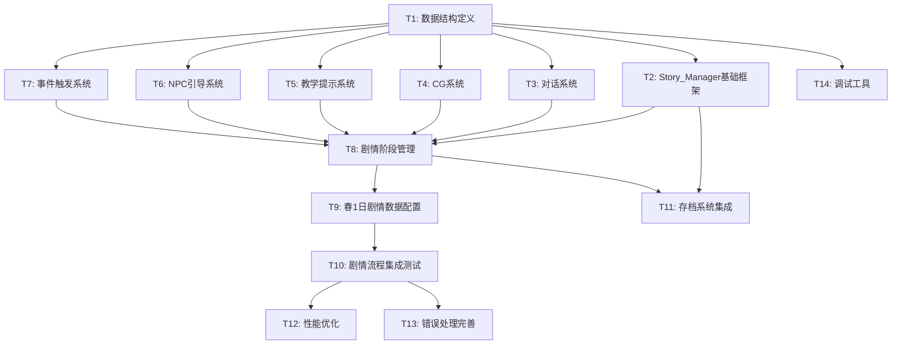

# 任务拆解：春1日剧情实现

## 概述

本文档将春1日剧情实现拆解为可执行的开发任务。任务按照依赖关系组织，每个任务包含：
- 任务目标：要实现的功能
- 验收标准：如何判断任务完成
- 依赖任务：必须先完成的前置任务
- 预估工作量：1-3天为合理粒度

## 任务优先级定义

- **P0（必须完成）**：核心剧情流程，缺少则无法运行春1日
- **P1（重要）**：增强体验和稳定性，建议在首版完成
- **P2（可选）**：优化和调试工具，可在后续迭代补充

## 任务依赖图



---

## P0 任务：核心系统实现

### T1: 数据结构定义（ScriptableObject 和事件）

**优先级**: P0  
**预估工作量**: 1天  
**依赖**: 无

#### 任务目标

创建所有剧情系统所需的 ScriptableObject 数据结构和事件定义。

#### 具体工作

1. **创建多态动作系统**（`Assets/Scripts/Story/Data/Actions/`）
   - `StoryAction.cs` - 抽象基类
   - `PlayDialogueAction.cs` - 播放对话动作
   - `PlayCGAction.cs` - 播放CG动作
   - `ShowTutorialAction.cs` - 显示教学提示动作
   - `StartNPCGuideAction.cs` - 启动NPC引导动作
   - `GiveItemAction.cs` - 给予物品动作
   - `ModifyEnergyAction.cs` - 修改精力动作
   - `SetVariableAction.cs` - 设置剧情变量动作
   - `WaitForEventAction.cs` - 等待事件动作

2. **创建数据容器 ScriptableObject**（`Assets/Scripts/Story/Data/`）
   - `DialogueData.cs` - 对话数据
   - `CGSequenceData.cs` - CG序列数据
   - `TutorialPromptData.cs` - 教学提示数据
   - `NPCGuideData.cs` - NPC引导数据
   - `StoryStageData.cs` - 剧情阶段数据
   - `EventTriggerData.cs` - 事件触发器数据

3. **创建事件定义**（`Assets/Scripts/Story/Events/StoryEvents.cs`）
   - `StoryStageChangedEvent` - 剧情阶段变化
   - `DialogueStartedEvent` - 对话开始
   - `DialogueEndedEvent` - 对话结束
   - `CGStartedEvent` - CG开始
   - `CGEndedEvent` - CG结束
   - `TutorialStepCompletedEvent` - 教学步骤完成

#### 验收标准

- [ ] 所有 ScriptableObject 类可在 Unity Editor 中创建资源
- [ ] 多态动作系统在 Inspector 中显示正确（只显示相关字段）
- [ ] 所有事件类实现 `IGameEvent` 接口
- [ ] 代码通过编译，无警告
- [ ] 遵循项目编码规范（Region 分区、命名规范）

---

### T2: Story_Manager 基础框架

**优先级**: P0  
**预估工作量**: 1天  
**依赖**: T1

#### 任务目标

实现 Story_Manager 单例和基础生命周期管理。

#### 具体工作

1. **创建 Story_Manager.cs**（`Assets/Scripts/Story/Story_Manager.cs`）
   - 单例模式实现
   - 持有各子系统引用（Dialogue_System、CG_System 等）
   - 当前剧情阶段状态管理
   - 剧情变量字典（`Dictionary<string, object>`）
   - 时间控制栈（`Stack<TimeControlState>`）

2. **实现核心接口**
   - `StartStory(StoryStageData initialStage)` - 启动剧情
   - `AdvanceToStage(string stageId)` - 推进到指定阶段
   - `PauseTime()` / `ResumeTime()` - 时间控制
   - `SetVariable(string key, object value)` - 设置剧情变量
   - `GetVariable<T>(string key)` - 获取剧情变量

3. **集成 EventBus**
   - 发布 `StoryStageChangedEvent` 事件
   - 订阅必要的游戏事件（如玩家晕倒、睡觉）

#### 验收标准

- [ ] Story_Manager 可在场景中作为单例访问
- [ ] 时间控制栈正确支持嵌套暂停/恢复
- [ ] 剧情变量可正确存取（支持 int、bool、string 类型）
- [ ] 阶段切换时正确发布事件
- [ ] 代码遵循零GC原则（高频函数无 new 操作）

---

### T3: 对话系统（Dialogue_System）

**优先级**: P0  
**预估工作量**: 2天  
**依赖**: T1

#### 任务目标

实现对话显示、打字机效果、玩家选择功能。

#### 具体工作

1. **创建 Dialogue_System.cs**（`Assets/Scripts/Story/Systems/Dialogue_System.cs`）
   - 单例模式实现
   - `PlayDialogue(DialogueData data, Action onComplete)` 接口
   - 对话队列管理（支持连续对话）
   - 打字机效果协程（使用 StringBuilder 避免GC）
   - 玩家选择处理（分支对话）

2. **创建对话框UI**（`Assets/Prefabs/UI/DialogueBox.prefab`）
   - 布局：屏幕下方1/3
   - 组件：头像区（Image）、名称区（TextMeshProUGUI）、文本区（TextMeshProUGUI）
   - 选择按钮区（动态生成按钮）
   - 淡入淡出动画（CanvasGroup + DOTween）

3. **对象池优化**
   - 复用 TextMeshProUGUI 组件
   - 复用选择按钮对象

#### 验收标准

- [ ] 对话框正确显示在屏幕下方1/3位置
- [ ] 打字机效果流畅（每字符0.05秒）
- [ ] 玩家可通过点击加速/跳过对话
- [ ] 分支对话选择功能正常
- [ ] 对话结束后正确触发回调
- [ ] 无GC分配（使用 Profiler 验证）
- [ ] UI动画使用 EaseOutQuad 缓动，时长0.3秒

---

### T4: CG系统（CG_System）

**优先级**: P0  
**预估工作量**: 1.5天  
**依赖**: T1

#### 任务目标

实现CG序列播放、淡入淡出、跳过功能。

#### 具体工作

1. **创建 CG_System.cs**（`Assets/Scripts/Story/Systems/CG_System.cs`）
   - 单例模式实现
   - `PlayCGSequence(CGSequenceData data, Action onComplete)` 接口
   - CG帧序列播放（协程控制帧间隔）
   - 淡入淡出效果（CanvasGroup.alpha 插值）
   - 跳过功能（检测玩家输入）

2. **创建CG显示UI**（`Assets/Prefabs/UI/CGCanvas.prefab`）
   - 全屏 Canvas（覆盖所有UI）
   - Image 组件显示CG图片
   - CanvasGroup 控制透明度
   - 跳过提示文本（右下角）

3. **资源预加载机制**
   - 在阶段切换时预加载下一阶段的CG资源
   - 使用 `Resources.LoadAsync` 异步加载
   - 缓存已加载的 Sprite 避免重复加载

#### 验收标准

- [ ] CG序列按指定帧间隔播放
- [ ] 淡入淡出效果流畅（0.5秒）
- [ ] 玩家按空格键可跳过CG
- [ ] CG播放期间其他UI被遮挡
- [ ] CG结束后正确触发回调
- [ ] 资源预加载不阻塞主线程
- [ ] 无GC分配（复用 Image 组件）

---

### T5: 教学提示系统（Tutorial_Prompt_System）

**优先级**: P0  
**预估工作量**: 1天  
**依赖**: T1

#### 任务目标

实现教学提示显示、自动消失、手动关闭功能。

#### 具体工作

1. **创建 Tutorial_Prompt_System.cs**（`Assets/Scripts/Story/Systems/Tutorial_Prompt_System.cs`）
   - 单例模式实现
   - `ShowPrompt(TutorialPromptData data, Action onComplete)` 接口
   - 提示队列管理（支持连续提示）
   - 自动消失计时器（可配置时长）
   - 手动关闭检测（点击或按键）

2. **创建教学提示UI**（`Assets/Prefabs/UI/TutorialPrompt.prefab`）
   - 布局：屏幕上方居中
   - 半透明背景（黑色，alpha 0.7）
   - 提示文本（TextMeshProUGUI，白色）
   - 关闭按钮（可选）
   - 淡入淡出动画

3. **与游戏事件集成**
   - 订阅相关游戏事件（如首次耕地、首次浇水）
   - 事件触发时自动显示对应提示
   - 提示完成后发布 `TutorialStepCompletedEvent`

#### 验收标准

- [ ] 提示正确显示在屏幕上方居中
- [ ] 提示在指定时长后自动消失
- [ ] 玩家可手动关闭提示
- [ ] 多个提示按队列顺序显示（不重叠）
- [ ] 提示完成后正确触发回调
- [ ] UI动画流畅（淡入淡出0.3秒）

---

### T6: NPC引导系统（NPC_Guide_System）

**优先级**: P0  
**预估工作量**: 2天  
**依赖**: T1

#### 任务目标

实现NPC移动引导、动画同步、路径寻找功能。

#### 具体工作

1. **创建 NPC_Guide_System.cs**（`Assets/Scripts/Story/Systems/NPC_Guide_System.cs`）
   - 单例模式实现
   - `StartGuide(NPCGuideData data, Action onComplete)` 接口
   - NPC移动控制（使用 NavMeshAgent 或简单插值）
   - 动画同步（根据移动方向播放行走动画）
   - 到达目标点检测

2. **NPC动画集成**
   - 获取NPC的 Animator 组件
   - 根据移动方向设置动画参数（moveX, moveY）
   - 停止时播放 Idle 动画

3. **路径寻找**
   - 如果使用 NavMeshAgent：配置 NavMesh 并设置目标点
   - 如果使用简单插值：检测路径上的障碍物，必要时绕行
   - 碰撞检测避免穿模

4. **视觉反馈**
   - NPC头顶显示引导图标（可选）
   - 目标点显示标记（可选）

#### 验收标准

- [ ] NPC可沿合法路径移动到目标点
- [ ] NPC动画与移动方向同步
- [ ] NPC不会穿墙或穿过障碍物
- [ ] 到达目标点后正确触发回调
- [ ] 移动速度可配置（通过 NPCGuideData）
- [ ] 无GC分配（复用路径数组）

---

### T7: 事件触发系统（Event_Trigger_System）

**优先级**: P0  
**预估工作量**: 2天  
**依赖**: T1

#### 任务目标

实现位置触发器、条件触发器、动作序列执行功能。

#### 具体工作

1. **创建 Event_Trigger_System.cs**（`Assets/Scripts/Story/Systems/Event_Trigger_System.cs`）
   - 单例模式实现
   - 触发器注册/注销接口
   - 位置触发器检测（使用空间分区优化）
   - 条件触发器检测（检查剧情变量、游戏状态）
   - 动作序列执行（按顺序执行 StoryAction 列表）

2. **创建触发器组件**（`Assets/Scripts/Story/Triggers/`）
   - `PositionTrigger.cs` - 位置触发器（MonoBehaviour）
   - `ConditionalTrigger.cs` - 条件触发器（MonoBehaviour）
   - 触发器配置（关联 EventTriggerData）
   - 触发器状态管理（已触发/未触发）

3. **空间分区优化**
   - 使用四叉树或网格分区
   - 只检测玩家附近的触发器（减少每帧检测数量）
   - 触发器激活/休眠机制

4. **动作执行器**
   - 顺序执行动作列表
   - 支持异步动作（等待回调）
   - 支持并行动作（同时执行多个动作）
   - 错误处理（动作执行失败时的降级策略）

#### 验收标准

- [ ] 玩家进入触发区域时正确触发事件
- [ ] 条件触发器在条件满足时正确触发
- [ ] 动作序列按顺序执行
- [ ] 异步动作正确等待完成后再执行下一个
- [ ] 触发器只触发一次（除非配置为可重复触发）
- [ ] 空间分区优化生效（Profiler 显示检测开销降低）
- [ ] 无GC分配（复用触发器列表）

---

### T8: 剧情阶段管理集成

**优先级**: P0  
**预估工作量**: 2天  
**依赖**: T2, T3, T4, T5, T6, T7

#### 任务目标

将所有子系统集成到 Story_Manager，实现完整的剧情阶段推进逻辑。

#### 具体工作

1. **完善 Story_Manager 阶段管理**
   - 加载 StoryStageData 并初始化触发器
   - 阶段切换时清理旧触发器、注册新触发器
   - 阶段切换时预加载下一阶段资源
   - 阶段完成条件检测（所有必需事件已触发）

2. **子系统协调**
   - Story_Manager 持有所有子系统引用
   - 通过 Event_Trigger_System 调度子系统任务
   - 处理子系统回调并推进剧情流程
   - 错误处理（子系统任务失败时的降级）

3. **时间控制集成**
   - 脚本化阶段自动暂停时间
   - 自由阶段恢复时间流逝
   - 时间控制栈正确处理嵌套场景

4. **与现有系统集成**
   - 订阅农田系统事件（耕地、播种、浇水、收获）
   - 订阅精力系统事件（精力耗尽、晕倒）
   - 订阅时间系统事件（睡觉、新的一天）
   - 订阅背包系统事件（物品获得、物品使用）

#### 验收标准

- [ ] 可通过 Story_Manager 启动春1日剧情
- [ ] 剧情阶段按设计顺序推进
- [ ] 阶段切换时触发器正确更新
- [ ] 时间控制在脚本化/自由阶段间正确切换
- [ ] 与现有系统的事件订阅正常工作
- [ ] 错误处理机制生效（子系统失败不导致崩溃）
- [ ] 代码遵循零GC原则

---

### T9: 春1日剧情数据配置

**优先级**: P0  
**预估工作量**: 3天  
**依赖**: T8

#### 任务目标

在 Unity Editor 中配置春1日完整剧情的所有数据资源。

#### 具体工作

1. **创建对话数据**（`Assets/Data/Story/Spring1/Dialogues/`）
   - 开场对话（玩家醒来，NPC介绍）
   - 农田教学对话（耕地、播种、浇水）
   - 制作教学对话（制作洒水壶）
   - 收获对话（收获萝卜）
   - 结束对话（睡觉前）
   - 配置头像、名称、文本、选择分支

2. **创建CG序列数据**（`Assets/Data/Story/Spring1/CGs/`）
   - 开场CG（玩家醒来场景）
   - 准备CG图片资源（Sprite）
   - 配置帧序列、帧间隔、淡入淡出时长

3. **创建教学提示数据**（`Assets/Data/Story/Spring1/Tutorials/`）
   - 移动教学
   - 耕地教学
   - 播种教学
   - 浇水教学
   - 收获教学
   - 制作教学
   - 配置提示文本、显示时长

4. **创建NPC引导数据**（`Assets/Data/Story/Spring1/NPCGuides/`）
   - NPC引导到农田
   - NPC引导到制作台
   - 配置NPC引用、目标点、移动速度

5. **创建事件触发器数据**（`Assets/Data/Story/Spring1/Triggers/`）
   - 位置触发器（进入农田、进入制作台区域）
   - 条件触发器（完成耕地、完成播种、完成浇水、完成收获）
   - 配置触发条件、动作序列

6. **创建剧情阶段数据**（`Assets/Data/Story/Spring1/Stages/`）
   - 阶段1：开场CG
   - 阶段2：NPC介绍
   - 阶段3：农田教学（脚本化）
   - 阶段4：自由耕作（自由）
   - 阶段5：制作教学（脚本化）
   - 阶段6：自由制作（自由）
   - 阶段7：收获教学（脚本化）
   - 阶段8：结束对话
   - 配置阶段类型、触发器列表、完成条件

7. **场景配置**
   - 在场景中放置触发器对象
   - 配置触发器的位置、大小、关联数据
   - 配置NPC初始位置

#### 验收标准

- [ ] 所有对话数据在 Inspector 中配置完整
- [ ] CG图片资源准备完毕并正确引用
- [ ] 教学提示文本符合需求文档
- [ ] NPC引导路径合理（不穿墙）
- [ ] 触发器位置与设计文档一致
- [ ] 剧情阶段数据完整覆盖春1日流程
- [ ] 场景中触发器对象正确放置
- [ ] 所有 ScriptableObject 引用无缺失

---

### T10: 剧情流程集成测试

**优先级**: P0  
**预估工作量**: 2天  
**依赖**: T9

#### 任务目标

完整测试春1日剧情流程，修复发现的问题。

#### 具体工作

1. **端到端测试**
   - 从游戏启动到春1日结束完整走一遍
   - 记录每个阶段的表现和问题
   - 验证所有正确性属性（design.md 中定义的21条）

2. **功能测试**
   - 对话系统：打字机效果、选择分支、跳过功能
   - CG系统：播放流畅度、淡入淡出、跳过功能
   - 教学提示：显示时机、自动消失、手动关闭
   - NPC引导：移动路径、动画同步、到达检测
   - 事件触发：位置触发、条件触发、动作执行

3. **集成测试**
   - 与农田系统集成：耕地、播种、浇水、收获
   - 与精力系统集成：精力消耗、精力恢复、晕倒处理
   - 与背包系统集成：物品获得、物品使用
   - 与时间系统集成：时间暂停/恢复、睡觉触发

4. **异常测试**
   - 玩家跳过教学直接操作
   - 玩家在剧情中途晕倒
   - 玩家在剧情中途睡觉
   - 数据资源缺失
   - 时间冲突（多个系统同时请求暂停时间）

5. **问题修复**
   - 记录所有发现的问题
   - 按优先级修复（P0问题必须修复）
   - 回归测试确保修复有效

#### 验收标准

- [ ] 春1日剧情可从头到尾完整运行
- [ ] 所有21条正确性属性通过验证
- [ ] 功能测试无阻塞性问题
- [ ] 集成测试无数据不一致问题
- [ ] 异常测试无崩溃或卡死
- [ ] P0问题全部修复
- [ ] 测试报告文档完成

---

## P1 任务：稳定性与优化

### T11: 存档系统集成

**优先级**: P1  
**预估工作量**: 1.5天  
**依赖**: T2, T8

#### 任务目标

实现剧情进度的持久化和恢复功能。

#### 具体工作

1. **Story_Manager 实现 IPersistentObject**
   - 定义持久化数据结构（`StoryProgressData`）
   - 实现 `GetPersistentData()` 方法
   - 实现 `LoadPersistentData()` 方法
   - 注册到 `PersistentObjectRegistry`

2. **持久化数据定义**
   ```csharp
   [Serializable]
   public class StoryProgressData
   {
       public string currentStageId;
       public Dictionary<string, object> variables;
       public List<string> triggeredEvents;
       public float savedTime;
   }
   ```

3. **状态恢复逻辑**
   - 加载存档时恢复当前剧情阶段
   - 恢复剧情变量字典
   - 恢复已触发事件列表（避免重复触发）
   - 恢复UI状态（如血条、精力条的显示）

4. **存档兼容性**
   - 处理旧版本存档（字段缺失时使用默认值）
   - 数据校验（检测损坏的存档）
   - 错误处理（存档加载失败时的降级策略）

#### 验收标准

- [ ] 剧情进度可正确保存到存档
- [ ] 加载存档后剧情状态正确恢复
- [ ] 已触发事件不会重复触发
- [ ] 剧情变量正确恢复
- [ ] UI状态正确恢复
- [ ] 旧版本存档可兼容加载
- [ ] 存档损坏时不崩溃（显示错误提示）

---

### T12: 性能优化

**优先级**: P1  
**预估工作量**: 1天  
**依赖**: T10

#### 任务目标

优化剧情系统性能，确保无GC分配和流畅运行。

#### 具体工作

1. **GC优化**
   - 使用 Unity Profiler 检测GC分配点
   - 对话系统：StringBuilder 复用、TextMeshPro 对象池
   - 事件触发系统：触发器列表预分配、空间分区缓存
   - 动作执行器：动作列表复用、回调委托缓存

2. **空间分区优化**
   - 实现四叉树或网格分区
   - 只检测玩家附近的触发器（半径可配置）
   - 触发器激活/休眠机制（远离玩家时休眠）

3. **资源加载优化**
   - CG资源预加载（阶段切换时异步加载）
   - 对话头像缓存（避免重复加载）
   - 音效预加载（如对话音效、UI音效）

4. **协程优化**
   - 打字机效果使用 WaitForSeconds 缓存
   - CG播放使用固定时间步长
   - 避免每帧创建新的 YieldInstruction

#### 验收标准

- [ ] Unity Profiler 显示无GC分配（或GC < 1KB/frame）
- [ ] 触发器检测开销 < 0.5ms/frame
- [ ] 对话打字机效果流畅（60fps）
- [ ] CG播放流畅（60fps）
- [ ] 资源加载不阻塞主线程
- [ ] 协程开销 < 0.2ms/frame

---

### T13: 错误处理完善

**优先级**: P1  
**预估工作量**: 1天  
**依赖**: T10

#### 任务目标

完善错误处理和降级策略，提高系统鲁棒性。

#### 具体工作

1. **数据校验**
   - Story_Manager 启动时检查所有 ScriptableObject 引用
   - 检查对话数据完整性（文本非空、头像存在）
   - 检查CG数据完整性（Sprite 引用存在）
   - 检查触发器配置（位置合法、动作列表非空）

2. **降级策略**
   - 对话头像缺失：使用默认占位头像
   - CG资源缺失：显示占位图片或跳过CG
   - 音效缺失：静默播放（不影响流程）
   - 触发器配置错误：记录错误日志并跳过该触发器

3. **错误日志规范**
   - 统一日志格式：`[Story][系统名] 错误信息`
   - 日志级别：Error（阻塞性问题）、Warning（降级处理）、Info（正常流程）
   - 日志开关：可在 Inspector 中配置是否显示详细日志

4. **异常处理**
   - 捕获动作执行异常（try-catch）
   - 捕获资源加载异常
   - 捕获协程异常
   - 异常发生时记录日志并尝试恢复

#### 验收标准

- [ ] 启动时数据校验正常工作
- [ ] 资源缺失时降级策略生效
- [ ] 错误日志格式统一且信息完整
- [ ] 异常不导致游戏崩溃
- [ ] 日志开关可正常控制日志输出
- [ ] 所有错误情况都有对应的处理逻辑

---

## P2 任务：调试与工具

### T14: 调试工具

**优先级**: P2  
**预估工作量**: 1.5天  
**依赖**: T1, T2

#### 任务目标

实现剧情调试工具，方便开发和测试。

#### 具体工作

1. **创建编辑器窗口**（`Assets/Editor/StoryDebugWindow.cs`）
   - 菜单项：`Window > Story > Debug Window`
   - 显示当前剧情阶段
   - 显示剧情变量列表（可编辑）
   - 显示已触发事件列表
   - 显示当前激活的触发器列表

2. **快速跳转功能**
   - 下拉菜单选择剧情阶段
   - 点击按钮跳转到指定阶段
   - 跳转时自动设置必要的剧情变量
   - 跳转时清理旧触发器、注册新触发器

3. **变量修改功能**
   - 在 Inspector 中直接修改剧情变量
   - 支持 int、bool、string 类型
   - 修改后立即生效（用于测试条件触发器）

4. **触发器可视化**
   - 在 Scene 视图中显示触发器边界（Gizmos）
   - 不同类型触发器使用不同颜色
   - 已触发的触发器显示为灰色
   - 点击触发器显示详细信息

5. **日志查看器**
   - 显示剧情系统的所有日志
   - 支持按级别过滤（Error/Warning/Info）
   - 支持按系统过滤（Dialogue/CG/Tutorial等）
   - 支持搜索和导出

#### 验收标准

- [ ] 编辑器窗口可正常打开
- [ ] 当前剧情状态正确显示
- [ ] 快速跳转功能正常工作
- [ ] 变量修改立即生效
- [ ] 触发器在 Scene 视图中正确显示
- [ ] 日志查看器功能完整
- [ ] 工具不影响运行时性能

---

## 任务总结

### 任务统计

- **P0 任务**：10个（T1-T10），预估工作量 18.5天
- **P1 任务**：3个（T11-T13），预估工作量 3.5天
- **P2 任务**：1个（T14），预估工作量 1.5天
- **总计**：14个任务，预估工作量 23.5天

### 关键路径

```
T1 → T2 → T8 → T9 → T10
```

关键路径工作量：9天

### 并行开发建议

可并行开发的任务组：
- **组1**：T3（对话系统）、T4（CG系统）、T5（教学提示系统）
- **组2**：T6（NPC引导系统）、T7（事件触发系统）

### 里程碑

1. **里程碑1**：数据结构和基础框架完成（T1-T2，2天）
2. **里程碑2**：所有子系统完成（T3-T7，7天）
3. **里程碑3**：系统集成完成（T8，2天）
4. **里程碑4**：数据配置完成（T9，3天）
5. **里程碑5**：测试通过（T10，2天）
6. **里程碑6**：稳定性优化完成（T11-T13，3.5天）
7. **里程碑7**：调试工具完成（T14，1.5天）

### 风险提示

1. **T9（数据配置）**：工作量可能被低估，实际配置可能需要更多时间
2. **T10（集成测试）**：可能发现大量问题，需要预留缓冲时间
3. **T6（NPC引导）**：如果使用 NavMesh，需要先配置场景导航网格
4. **T7（事件触发）**：空间分区实现较复杂，可能需要更多时间

### 建议开发顺序

**第一周**：
- Day 1-2：T1（数据结构）
- Day 3：T2（Story_Manager）
- Day 4-5：T3（对话系统）

**第二周**：
- Day 1-2：T4（CG系统）+ T5（教学提示）
- Day 3-4：T6（NPC引导）
- Day 5：T7（事件触发）开始

**第三周**：
- Day 1：T7（事件触发）完成
- Day 2-3：T8（系统集成）
- Day 4-5：T9（数据配置）开始

**第四周**：
- Day 1：T9（数据配置）完成
- Day 2-3：T10（集成测试）
- Day 4-5：T11-T13（优化和错误处理）

**第五周**（可选）：
- Day 1-2：T14（调试工具）
- Day 3-5：缓冲时间（修复遗留问题）

