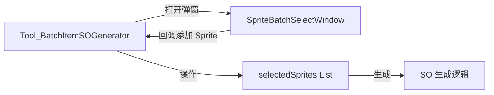

# 设计文档：批量生成物品工具 Sprite 选择优化

## 概述

本设计优化 `Tool_BatchItemSOGenerator` 的 Sprite 选择区域，涉及三个核心改动：

1. 按钮区域重构：将单一「获取选中项」按钮拆分为「获取选中项」+「批量选择」两个按钮
2. 新增批量选择弹窗：独立 `EditorWindow`，从 Texture/文件夹中网格展示 Sprite 并支持勾选
3. 已选列表升级：移除截断显示，新增拖拽排序、右键菜单、完整展示

所有改动限定在 Unity Editor 工具层，不影响运行时代码。

## 架构

### 组件关系



### 改动范围

| 文件 | 改动类型 | 说明 |
|------|---------|------|
| `Assets/Editor/Tool_BatchItemSOGenerator.cs` | 修改 | 重写 `DrawSpriteSelection()` 方法，新增拖拽排序和右键菜单逻辑 |
| `Assets/Editor/SpriteBatchSelectWindow.cs` | 新增 | 独立的 Sprite 批量选择弹窗 |

## 组件与接口

### 1. Tool_BatchItemSOGenerator 改动

#### DrawSpriteSelection() 重写

当前实现：
- 单个「获取选中项」按钮
- 预览列表最多 10 项，超出显示"还有 XX 项"
- 无排序、无右键菜单

新实现：
- 两个并排按钮：「获取选中项」「批量选择」
- 完整展示所有项（ScrollView，最大高度 300px）
- 每项显示：拖拽手柄 ≡ + 序号 + Sprite 图标 + 名称 + 预测 ID
- 支持拖拽排序（参考 `InventoryBootstrapEditor.HandleItemDrag`）
- 支持右键菜单（上移、下移、移到顶部、移到底部、删除）

#### 拖拽排序实现

参考 `InventoryBootstrapEditor` 的拖拽模式，但直接操作 `List<Sprite>` 而非 `SerializedProperty`：

```csharp
// 拖拽状态字段
private bool _isDraggingSprite = false;
private int _dragSourceIndex = -1;
private int _dragTargetIndex = -1;
```

拖拽流程：
1. `MouseDown` 在手柄区域 → 记录源索引，设置 `hotControl`
2. `MouseDrag` → 检测鼠标位置，更新目标索引，高亮目标行
3. `MouseUp` → 执行 `List.RemoveAt` + `List.Insert` 移动元素，重置状态

#### 右键菜单实现

使用 `GenericMenu` 构建上下文菜单：

```csharp
private void ShowSpriteContextMenu(int index)
{
    GenericMenu menu = new GenericMenu();
    if (index > 0)
        menu.AddItem(new GUIContent("上移"), false, () => SwapSprites(index, index - 1));
    else
        menu.AddDisabledItem(new GUIContent("上移"));
    // ... 下移、移到顶部、移到底部、删除
    menu.ShowAsContext();
}
```

### 2. SpriteBatchSelectWindow（新增）

独立的 `EditorWindow`，参考 `ItemBatchSelectWindow` 的交互模式。

#### 接口设计

```csharp
public class SpriteBatchSelectWindow : EditorWindow
{
    // 回调：将选中的 Sprite 列表传回 Generator
    private static System.Action<List<Sprite>> onSpritesSelected;
    
    // 打开弹窗的静态方法
    public static void ShowWindow(System.Action<List<Sprite>> callback)
    {
        onSpritesSelected = callback;
        var window = GetWindow<SpriteBatchSelectWindow>(true, "批量选择 Sprite", true);
        window.minSize = new Vector2(500, 400);
        window.LoadSpritesFromSelection();
        window.Show();
    }
}
```

#### 核心字段

```csharp
private List<Sprite> allSprites = new List<Sprite>();       // 从选中资源加载的所有 Sprite
private HashSet<Sprite> selectedSprites = new HashSet<Sprite>(); // 用户勾选的 Sprite
private string searchFilter = "";                            // 搜索关键词
private Vector2 scrollPosition;                              // 滚动位置
```

#### 加载逻辑

`LoadSpritesFromSelection()` 遍历 `Selection.objects`：
- 如果是 `Texture2D`：用 `AssetDatabase.LoadAllAssetsAtPath` 提取所有 Sprite 子资源
- 如果是文件夹（`DefaultAsset`）：用 `AssetDatabase.FindAssets("t:Texture2D")` 递归查找，再提取 Sprite
- 按名称排序

#### UI 布局

```
┌─────────────────────────────────────────┐
│ 搜索: [________] × │ 已选: N │ 全选 │ 取消 │
├─────────────────────────────────────────┤
│ ☑ [icon] sprite_name_1  ☑ [icon] name2 │
│ ☐ [icon] sprite_name_3  ☑ [icon] name4 │
│ ...                                     │
├─────────────────────────────────────────┤
│                          [取消] [添加(N)]│
└─────────────────────────────────────────┘
```

- 顶部工具栏：搜索框 + 已选数量 + 全选/取消全选
- 中间网格：每项包含勾选框 + Sprite 图标 + 名称
- 底部按钮：取消 + 添加（显示选中数量）

#### 搜索筛选

```csharp
private List<Sprite> GetFilteredSprites()
{
    if (string.IsNullOrEmpty(searchFilter))
        return allSprites;
    string filter = searchFilter.ToLower();
    return allSprites.Where(s => s.name.ToLower().Contains(filter)).ToList();
}
```

#### 添加回调

点击「添加」时，将选中的 Sprite 按原始排序（`allSprites` 中的顺序）通过回调传回 Generator：

```csharp
private void AddSelectedSprites()
{
    var ordered = allSprites.Where(s => selectedSprites.Contains(s)).ToList();
    onSpritesSelected?.Invoke(ordered);
    Close();
}
```

Generator 端接收回调后追加到 `selectedSprites`：

```csharp
private void OpenBatchSelectWindow()
{
    SpriteBatchSelectWindow.ShowWindow(sprites => {
        foreach (var s in sprites)
        {
            if (!selectedSprites.Contains(s))
                selectedSprites.Add(s);
        }
        Repaint();
    });
}
```

## 数据模型

本次优化不引入新的数据模型。核心数据结构保持不变：

```csharp
// Tool_BatchItemSOGenerator 中已有字段
private List<Sprite> selectedSprites = new List<Sprite>();
```

所有 UI 操作（拖拽排序、右键菜单、批量添加）直接操作此列表。生成逻辑按列表索引分配 ID，无需额外映射。


## 正确性属性

正确性属性是系统应当在所有有效执行中保持为真的特征或行为——本质上是对系统应做什么的形式化陈述。属性是人类可读规格与机器可验证正确性保证之间的桥梁。

以下属性基于需求文档中的验收标准推导而来。由于本功能是 Unity Editor 工具，大部分 UI 交互行为（按钮点击、弹窗打开、拖拽视觉反馈）无法通过自动化测试验证，因此属性集中在可独立测试的数据操作逻辑上。

### Property 1：搜索筛选正确性

*For any* Sprite 列表和任意非空搜索关键词，筛选结果中的每个 Sprite 的名称（转小写后）都应包含该关键词（转小写后），且原列表中所有名称包含该关键词的 Sprite 都应出现在筛选结果中。

**Validates: Requirements 2.4**

### Property 2：全选操作正确性

*For any* Sprite 列表和任意搜索筛选条件，执行全选后，所有通过当前筛选条件的 Sprite 都应处于选中状态；执行取消全选后，选中集合应为空。

**Validates: Requirements 2.5**

### Property 3：添加操作追加且保持排序

*For any* 已选列表和任意新增 Sprite 集合，添加操作后：列表长度等于原长度加上新增的不重复项数，新增项按原始排序出现在列表末尾，原有项的相对顺序不变。

**Validates: Requirements 2.6**

### Property 4：列表移动操作保持元素完整性

*For any* 非空 Sprite 列表和任意有效的移动操作（拖拽移动、上移、下移、移到顶部、移到底部），操作后列表长度不变，列表包含的元素集合不变（仅顺序改变），且目标位置的元素等于被移动的元素。

**Validates: Requirements 4.1, 5.2, 5.3, 5.4, 5.5**

### Property 5：删除操作正确性

*For any* 非空 Sprite 列表和任意有效索引，删除该索引的元素后，列表长度减 1，被删除的元素不再出现在列表中，其余元素的相对顺序不变。

**Validates: Requirements 5.6**

### Property 6：预测 ID 不变量

*For any* Sprite 列表和任意起始 ID（startID），列表中第 i 项（从 0 开始）的预测 ID 始终等于 startID + i。此不变量在任何列表操作（添加、移动、删除）后都必须成立。

**Validates: Requirements 4.2, 5.7, 6.2**

## 错误处理

| 场景 | 处理方式 |
|------|---------|
| 用户未选中任何资源就点击「批量选择」 | 弹窗显示提示信息，不崩溃 |
| 选中的资源中不包含任何 Sprite | 弹窗显示"未找到 Sprite"提示 |
| 拖拽到列表外部 | 取消拖拽操作，恢复原状 |
| 添加重复的 Sprite | 跳过已存在的 Sprite，只添加新的 |
| selectedSprites 为空时右键菜单 | 不显示菜单（无项可操作） |

## 测试策略

### 测试方法

由于本功能是 Unity Editor 工具，核心 UI 交互（拖拽、右键菜单、弹窗）依赖 Unity Editor 环境，不适合纯单元测试。测试策略如下：

1. **手动验收测试**：覆盖所有 UI 交互行为（按钮、拖拽、右键菜单、弹窗）
2. **代码审查**：确保数据操作逻辑正确（列表移动、搜索筛选、ID 计算）

### 可提取为独立函数进行测试的逻辑

如果需要自动化测试，可以将以下逻辑提取为静态辅助方法：

- 搜索筛选逻辑（`GetFilteredSprites`）
- 列表移动逻辑（`MoveElement`、`SwapElements`）
- 预测 ID 计算逻辑

但考虑到这是 Editor 工具且逻辑相对简单，手动验收测试是更实际的选择。

### 属性测试配置

如果选择实现属性测试：
- 测试框架：NUnit（Unity 内置）
- 每个属性测试至少 100 次迭代
- 标签格式：`Feature: batch-item-so-generator-optimization, Property {N}: {描述}`
