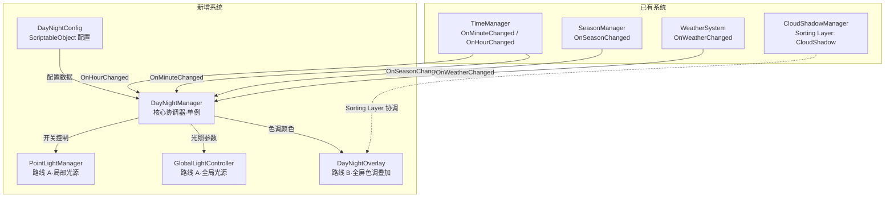
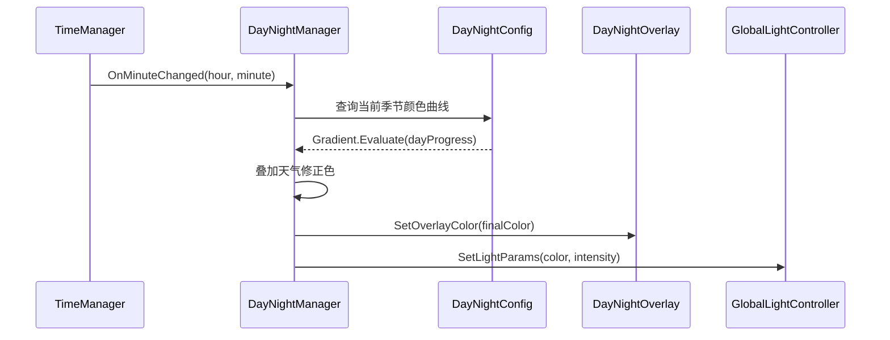

# 设计文档：全局昼夜更替光影系统

## 概述

本系统采用双路线架构实现 2D 像素风农场游戏的昼夜更替光影效果：

- **路线 B（基础层）**：使用全屏 SpriteRenderer + Multiply 混合模式实现色调叠加，参考 CloudShadowManager 的成功经验。不依赖 URP，可在内置渲染管线下独立运行。
- **路线 A（增强层）**：基于 URP 2D 光照系统，提供 Global Light 2D 和 Point Light 2D 效果。作为可选增强模块，通过开关控制。

核心设计原则：
1. 路线 B 必须独立运行，不依赖 URP
2. 路线 A 为可选增强，开关控制
3. 新增系统不破坏现有功能（CloudShadowManager、TimeManager 等）
4. 遵循项目现有的单例模式和事件订阅风格
5. 所有配置通过 ScriptableObject 管理

## 架构

### 系统架构图



### 数据流



## 组件与接口

### 1. DayNightConfig（ScriptableObject）

配置资产，存储所有光影参数。通过 `[CreateAssetMenu]` 在编辑器中创建。

```csharp
[CreateAssetMenu(fileName = "DayNightConfig", menuName = "Game/DayNight Config")]
public class DayNightConfig : ScriptableObject
{
    // ═══ 路线 B：颜色叠加配置 ═══
    [Header("━━━━ 季节颜色曲线（路线 B）━━━━")]
    public Gradient springGradient;   // 春季 24h 色调
    public Gradient summerGradient;   // 夏季 24h 色调
    public Gradient autumnGradient;   // 秋季 24h 色调
    public Gradient winterGradient;   // 冬季 24h 色调

    [Header("━━━━ 天气修正色 ━━━━")]
    public Color rainyTint;           // 雨天修正色（偏灰偏暗）
    public Color witheringTint;       // 枯萎天修正色（偏黄偏干燥）
    public float weatherTintStrength; // 天气修正强度 0-1

    [Header("━━━━ 过渡参数 ━━━━")]
    public float weatherTransitionDuration;  // 天气过渡时长（秒）
    public float timeJumpTransitionDuration; // 时间跳跃过渡时长（秒）
    public float seasonTransitionDuration;   // 季节过渡时长（秒）

    // ═══ 路线 A：URP 光照配置 ═══
    [Header("━━━━ 全局光照曲线（路线 A）━━━━")]
    public AnimationCurve globalLightIntensityCurve; // 24h 光照强度曲线
    public Gradient globalLightColorGradient;        // 24h 光照颜色曲线

    [Header("━━━━ 局部光源（路线 A）━━━━")]
    public float nightLightActivateHour;   // 夜间光源激活时间（默认 18）
    public float nightLightDeactivateHour; // 夜间光源关闭时间（默认 6）
    public float pointLightFadeDuration;   // 点光源淡入淡出时长（秒）

    [Header("━━━━ 路线融合 ━━━━")]
    public float overlayStrengthWithURP;   // 路线 A 启用时路线 B 的叠加强度（默认 0.3-0.5）
    public float overlayStrengthWithoutURP; // 仅路线 B 时的叠加强度（默认 1.0）

    // 公共方法：根据季节获取对应 Gradient
    public Gradient GetSeasonGradient(SeasonManager.Season season) { ... }
}
```

### 2. DayNightManager（核心协调器）

单例组件，挂载在 MANAGERS 层级下。负责订阅事件、计算颜色、协调路线 A/B。

```csharp
public class DayNightManager : MonoBehaviour
{
    // 单例
    public static DayNightManager Instance { get; private set; }

    [Header("━━━━ 配置 ━━━━")]
    [SerializeField] private DayNightConfig config;

    [Header("━━━━ 路线控制 ━━━━")]
    [SerializeField] private bool enableRouteA = false; // 路线 A 开关

    [Header("━━━━ 组件引用 ━━━━")]
    [SerializeField] private DayNightOverlay overlay;         // 路线 B
    [SerializeField] private GlobalLightController globalLight; // 路线 A（可选）
    [SerializeField] private PointLightManager pointLightMgr;  // 路线 A（可选）

    // ═══ 内部状态 ═══
    private Color currentBaseColor;      // 当前基础色调（来自季节 Gradient）
    private Color currentWeatherTint;    // 当前天气修正色
    private Color targetWeatherTint;     // 目标天气修正色
    private Color finalOverlayColor;     // 最终叠加颜色
    private float weatherTransitionTimer;
    private bool isTransitioning;        // 是否正在过渡（时间跳跃）

    // ═══ 公共接口 ═══
    public Color GetCurrentOverlayColor();
    public float GetCurrentBrightness();
    public bool IsNightMode();
    public void SetOverlayStrength(float strength);

    // ═══ 核心方法 ═══
    private void OnMinuteChanged(int hour, int minute);
    private void OnHourChanged(int hour);
    private void OnSeasonChanged(SeasonManager.Season season, int year);
    private void OnWeatherChanged(WeatherSystem.Weather weather);
    private Color CalculateOverlayColor(float dayProgress);
    private void ApplyWeatherModifier(ref Color baseColor);
    private void UpdateOverlay();
    private void UpdateGlobalLight();  // 路线 A
    private void UpdatePointLights();  // 路线 A
}
```


### 3. DayNightOverlay（路线 B 实现）

全屏颜色叠加组件。参考 CloudShadowManager 的 Multiply 材质方案。

```csharp
public class DayNightOverlay : MonoBehaviour
{
    [SerializeField] private SpriteRenderer spriteRenderer;
    [SerializeField] private Material multiplyMaterial; // Multiply 混合模式材质

    // 跟随摄像机
    private Camera mainCamera;

    public void SetColor(Color color);
    public void SetStrength(float strength); // 控制叠加强度
    private void LateUpdate(); // 跟随摄像机位置，调整尺寸覆盖视口
}
```

实现要点：
- 使用纯白色 Sprite（或程序生成的白色纹理）
- 材质使用 Multiply 混合模式（与 CloudShadowManager 一致）
- Sorting Layer 设置为高于 CloudShadow 的层级（或使用 CloudShadow 层但 Order 更高）
- 在 `LateUpdate` 中跟随摄像机位置，确保始终覆盖视口
- Sprite 尺寸根据摄像机正交大小动态计算

### 4. GlobalLightController（路线 A）

封装 URP Global Light 2D 的控制逻辑。仅在路线 A 启用时激活。

```csharp
public class GlobalLightController : MonoBehaviour
{
    // 引用 Light2D 组件（URP）
    // 使用条件编译 #if URP_ENABLED 隔离 URP 依赖

    public void SetLightColor(Color color);
    public void SetLightIntensity(float intensity);
    public void SetEnabled(bool enabled);
}
```

### 5. PointLightManager（路线 A）

管理场景中的夜间局部光源。通过标签 `NightLight` 批量查找和控制。

```csharp
public class PointLightManager : MonoBehaviour
{
    [SerializeField] private string nightLightTag = "NightLight";

    private List<Light2DWrapper> nightLights; // 缓存的夜间光源列表

    public void ActivateNightLights(float fadeDuration);
    public void DeactivateNightLights(float fadeDuration);
    public void RefreshLightList(); // 重新扫描场景中的夜间光源
}
```

### 6. NightLightMarker（路线 A 辅助）

挂载在需要夜间亮灯的物体上的标记组件，供 PointLightManager 识别。

```csharp
public class NightLightMarker : MonoBehaviour
{
    [SerializeField] private float maxIntensity = 1.0f;
    [SerializeField] private Color lightColor = Color.yellow;
    [SerializeField] private float radius = 3f;
}
```

## 数据模型

### 颜色计算流程

```
最终颜色 = Lerp(基础色调, 天气修正色, 天气修正强度)

其中：
  基础色调 = 当前季节Gradient.Evaluate(dayProgress)
  dayProgress = TimeManager.GetDayProgress()  // 0-1，0=06:00, 1=02:00
  天气修正色 = config 中对应天气的修正颜色
  天气修正强度 = config.weatherTintStrength（天气为 Sunny 时为 0）
```

### 时间映射

TimeManager 的 `GetDayProgress()` 返回 0-1：
- 0.0 = 06:00（日出）
- 0.3 = 12:00（正午）
- 0.6 = 18:00（日落）
- 0.8 = 22:00（深夜）
- 1.0 = 02:00（凌晨，强制睡觉）

Gradient 的 `Evaluate(t)` 参数 t 直接使用 `dayProgress`，因此 Gradient 的关键帧需要按此映射设置：
- t=0.0 → 06:00 色调
- t=0.3 → 12:00 色调
- t=0.6 → 18:00 色调
- t=0.8 → 22:00 色调
- t=1.0 → 02:00 色调

### 季节颜色预设参考

| 时间 | dayProgress | 春季 | 夏季 | 秋季 | 冬季 |
|------|-------------|------|------|------|------|
| 06:00 | 0.00 | 淡绿金 | 暖金 | 橙金 | 冷蓝白 |
| 12:00 | 0.30 | 近白微绿 | 近白微暖 | 近白微橙 | 近白微蓝 |
| 18:00 | 0.60 | 绿橙 | 暖橙红 | 深橙 | 冷紫蓝 |
| 22:00 | 0.80 | 深蓝绿 | 深蓝暖 | 深蓝橙 | 深蓝紫 |
| 02:00 | 1.00 | 深蓝 | 深蓝紫 | 深蓝 | 深紫蓝 |

### Sorting Layer 策略

```
现有层级（从下到上）：
  Background → Ground → Layer 1 → Layer 2 → Layer 3 → Effects → CloudShadow → UI

新增策略：
  DayNightOverlay 放在 CloudShadow 层，Order = 100（高于 CloudShadowManager 的 Order 0）
  这样 DayNightOverlay 在 CloudShadow 之上，但在 UI 之下
```

### 路线 A/B 融合逻辑

```
if (路线 A 启用 && URP 已安装):
    overlay.strength = config.overlayStrengthWithURP     // 降低到 0.3-0.5
    globalLight.enabled = true
    pointLightMgr.enabled = true
else:
    overlay.strength = config.overlayStrengthWithoutURP  // 保持 1.0
    globalLight.enabled = false
    pointLightMgr.enabled = false
```


## 正确性属性

*正确性属性是一种应在系统所有有效执行中保持为真的特征或行为——本质上是关于系统应该做什么的形式化陈述。属性是人类可读规范与机器可验证正确性保证之间的桥梁。*

### 属性 1：时间→颜色映射一致性

*对于任意*季节和任意 dayProgress 值（0-1），DayNightManager 在晴天条件下计算出的 overlay 颜色，应该等于该季节对应 Gradient 在该 dayProgress 处的 Evaluate 结果。

**验证需求：1.2, 1.3, 4.2, 4.3, 4.4, 4.5**

### 属性 2：颜色平滑连续性

*对于任意*两个相邻的 dayProgress 值 t1 和 t2（|t1-t2| ≤ 一个时间步长），计算出的颜色 C1 和 C2 之间的差异（各通道差值绝对值之和）应该小于一个合理阈值，确保颜色变化是连续的而非跳变的。

**验证需求：3.1, 3.2**

### 属性 3：状态变化平滑过渡

*对于任意*状态变化事件（时间跳跃、季节变化、天气变化、路线开关切换），变化发生后的第一帧颜色不应等于最终目标颜色（正在过渡中），经过配置的过渡时长后颜色应收敛到目标颜色。

**验证需求：3.3, 4.6, 5.4, 11.4**

### 属性 4：天气修正效果

*对于任意*时间点和任意季节，雨天（Rainy）条件下的最终 overlay 颜色亮度应低于同一时间点晴天（Sunny）条件下的亮度；枯萎天（Withering）条件下的颜色应比晴天偏黄（R/G 通道比值更高）；晴天条件下最终颜色应等于基础色调（无天气修正）。

**验证需求：5.1, 5.2, 5.3**

### 属性 5：Overlay 跟随摄像机

*对于任意*摄像机位置，DayNightOverlay 的 transform.position（XY 分量）应等于摄像机的 transform.position（XY 分量），且 Overlay 的尺寸应完全覆盖摄像机的正交视口。

**验证需求：2.3**

### 属性 6：路线开关控制行为

*对于任意*路线 A 开关状态，当路线 A 关闭时 overlay 强度应等于 `config.overlayStrengthWithoutURP`，当路线 A 开启时 overlay 强度应等于 `config.overlayStrengthWithURP`，且 GlobalLightController 和 PointLightManager 的启用状态应与路线 A 开关一致。

**验证需求：11.2, 11.3**

## 错误处理

### 配置缺失

- 如果 DayNightManager 的 `config` 引用为空，在 `Awake` 中输出警告日志并禁用自身
- 如果季节 Gradient 为空，回退到默认的白色 Gradient（无色调变化）

### 组件引用缺失

- 如果 `overlay` 引用为空，跳过路线 B 更新，输出警告
- 如果路线 A 组件引用为空但 `enableRouteA` 为 true，自动将 `enableRouteA` 设为 false 并输出警告

### TimeManager 未就绪

- 如果 TimeManager.Instance 为空，DayNightManager 在 `Start` 中延迟订阅，使用协程等待 TimeManager 初始化完成

### 摄像机引用

- 使用 `Camera.main` 获取主摄像机，如果为空则尝试 `FindFirstObjectByType<Camera>()`
- 摄像机引用在 `Start` 中缓存，避免每帧查找


## 测试策略

### 测试框架

- 单元测试：Unity Test Framework（EditMode 测试）
- 属性测试：FsCheck.NUnit 或手动随机化测试（Unity 环境下使用 `System.Random` 生成随机输入，循环 100 次以上）

### 单元测试

针对具体示例和边界情况：

1. **特定时间点颜色验证**：验证 06:00、12:00、18:00、22:00、00:00 等关键时间点的颜色是否符合预设（需求 2.4-2.8）
2. **季节 Gradient 选择**：验证四个季节分别返回正确的 Gradient（需求 4.1）
3. **Sorting Layer 配置**：验证 DayNightOverlay 的 Sorting Layer 和 Order 设置正确（需求 2.2, 7.1）
4. **路线 A 开关默认状态**：验证默认关闭路线 A（需求 11.1）
5. **配置缺失回退**：验证 config 为空时的错误处理行为
6. **DayNightConfig 数据完整性**：验证配置包含四季 Gradient、天气修正色、过渡参数（需求 6.2-6.4）

### 属性测试

针对通用属性，每个属性运行 100 次以上随机输入：

1. **Feature: Z_光影系统, Property 1: 时间→颜色映射一致性**
   - 生成随机季节（0-3）和随机 dayProgress（0-1）
   - 验证计算颜色等于对应 Gradient.Evaluate 结果

2. **Feature: Z_光影系统, Property 2: 颜色平滑连续性**
   - 生成随机 dayProgress t，计算 t 和 t+Δ 的颜色
   - 验证颜色差异小于阈值

3. **Feature: Z_光影系统, Property 3: 状态变化平滑过渡**
   - 模拟随机状态变化，验证过渡行为

4. **Feature: Z_光影系统, Property 4: 天气修正效果**
   - 生成随机时间和季节，比较晴天/雨天/枯萎天的颜色差异

5. **Feature: Z_光影系统, Property 5: Overlay 跟随摄像机**
   - 生成随机摄像机位置，验证 Overlay 位置一致

6. **Feature: Z_光影系统, Property 6: 路线开关控制行为**
   - 随机切换路线 A 开关，验证组件状态和强度值
