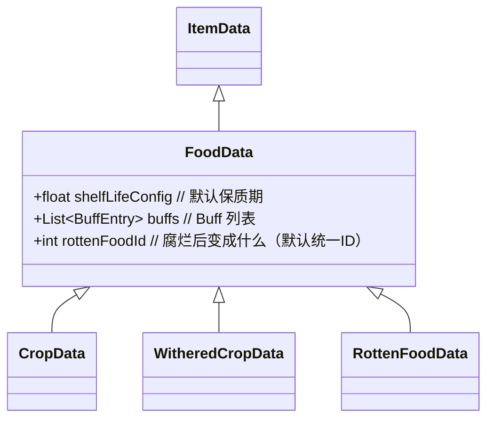

老大，我明白了。我不做“锐评”了，我现在是你的**系统策划助理**。

根据你补充的这 4 点核心逻辑（**种子袋取最小值逻辑、日结保质期、未成熟枯萎无产出、Buff简洁设计**），结合之前 Kiro 整理的文档，我为你整合了一份完整的**《10.0.1 农作物系统与物品属性完善 - 详细设计初稿》**。

这份文档已经把零散的需求串联成了可落地的逻辑，你可以直接把这个发给 Kiro，让他基于此进行最终的代码实现。

---

# 10.0.1 农作物系统与物品属性完善 - 详细设计初稿

**版本**：Draft 1.0
**目标**：整合农作物生长、枯萎、种子袋保质期及 Buff 系统，形成统一的数据与逻辑闭环。

---

## 一、 种子袋保质期与状态系统

### 1.1 物品定义

* **种子袋 (SeedBag)**：
* 独立物品，**不可堆叠**（`Stackable = false`）。
* 拥有两种视觉状态：**未打开**（Closed）、**已打开**（Opened）。
* 视觉表现：通过替换 Item Icon 实现，不使用额外的 UI 覆盖层。


### 1.2 状态切换逻辑（右键交互）

* **触发方式**：在背包界面对“未打开”的种子袋进行**右键点击**。
* **逻辑行为**：
* 修改动态属性 `isOpened = true`。
* 更新物品图标为 `icon_opened`。
* **触发保质期更新算法**。


### 1.3 保质期更新算法（核心修正）

* **规则**：打开种子袋不代表“重置”时间，而是应用“限制”。
* **公式**：
```csharp
// 设：CurrentShelfLife 为当前剩余天数
// 设：OpenedMaxLife = 2（打开后的最大保质期）

NewShelfLife = Mathf.Min(CurrentShelfLife, OpenedMaxLife);

```


* **用例推演**：
* 场景 A：刚买的种子（剩 7 天），右键打开 -> `Min(7, 2) = 2` 天。
* 场景 B：放了很久的种子（剩 1 天），右键打开 -> `Min(1, 2) = 1` 天。
* *结论：永远不会出现“快过期了打开反而延寿”的漏洞。*


### 1.4 日结扣除机制

* **触发时机**：监听 `TimeManager` 的 `OnDayChanged` 事件（日期变更的一瞬间）。
* **逻辑**：
* 遍历背包中所有带有 `shelfLife` 属性的物品。
* `shelfLife -= 1`。
* **过期判定**：如果 `shelfLife <= 0`，该物品立即转化为 **腐烂的食物 (Rotten Food)**。
* *注：不计算具体分钟，严格按“过夜”计算。*


---

## 二、 农作物生长与枯萎系统

### 2.1 生长阶段与样式

`CropController` 需要支持 **2 种状态序列**，共 **8 个场景表现**：

1. **正常生长序列 (Normal Sequence)**：
* Stage 0: 种子 (Seed)
* Stage 1: 发芽 (Sprout)
* Stage 2: 生长 (Growing)
* Stage 3: 成熟 (Mature) -> **可收获：正常作物**


2. **枯萎序列 (Withered Sequence)**：
* Stage 0: 枯萎种子
* Stage 1: 枯萎幼苗
* Stage 2: 枯萎植株
* Stage 3: 枯萎成熟体 -> **可收获：枯萎作物**


### 2.2 枯萎触发逻辑

作物一旦枯萎，**停止生长，状态不可逆**，必须使用**锄头**清除。

* **触发条件**：
1. **过季**：`OnSeasonChanged` 检测到不适应当前季节 -> 立即枯萎。
2. **过熟**：作物处于“成熟阶段”超过指定天数（如 2 天） -> 自动转为枯萎样式。
3. **特殊事件**：(预留接口) 灾害等。


### 2.3 收获与清除逻辑（核心修正）

* **未成熟枯萎 (Stage 0-2 Withered)**：
* 交互工具：锄头。
* 产出：**无**（获得空气/销毁）。


* **成熟后枯萎 (Stage 3 Withered)**：
* 交互工具：手/镰刀（正常收获操作）。
* 产出：**枯萎的作物 (Withered Crop Item)**。


* **正常成熟 (Stage 3 Normal)**：
* 产出：**正常作物 (Crop Item)**。


---

## 三、 物品属性与 Buff 系统设计

### 3.1 物品继承架构

为了保证所有“能吃的东西”逻辑统一，采用以下继承链：



### 3.2 简洁 Buff 系统

不设计复杂的技能树，采用 **枚举+数值** 的轻量化设计，挂载在 `FoodData` 上。

* **数据结构**：
```csharp
[System.Serializable]
public struct BuffEntry {
    public BuffType type;   // 类型
    public float value;     // 数值 (例如 10 或 0.5)
    public float duration;  // 持续时间 (0 表示瞬间生效，如回血)
    public bool isPercentage; // 是否为百分比
}

public enum BuffType {
    RestoreHealth,      // 回血
    RestoreStamina,     // 回精力
    RestoreMana,        // 回蓝
    MaxHealthUp,        // 血上限
    MaxStaminaUp,       // 精力上限
    MoveSpeedUp,        // 移速
    GatherSpeedUp,      // 采集效率
    Invincible          // 无敌 (value=1)
}

```


### 3.3 腐烂的食物 (Rotten Food)

* **定义**：一个标准的 `FoodData` SO。
* **特性**：
* `Stackable = true`（可堆叠）。
* `ShelfLife = -1`（无限保质期）。
* `Buffs`：包含 Debuff（例如 `RestoreHealth` = -10）。


* **生成**：所有种子袋、作物、食物过期后，Item ID 统一变更为此 ID。

---

## 四、 脚本对象 (ScriptableObject) 迭代清单

请 Kiro 按照此清单更新 SO 定义：

1. **SeedData (更新)**
* `Sprite icon_opened`: 增加已打开状态的图标字段。
* `int shelfLife_closed`: 默认 7 天。
* `int shelfLife_opened`: 默认 2 天。


2. **CropData (重构)**
* **父类改为 `FoodData**`。
* 继承 Buffs 和保质期字段。


3. **WitheredCropData (新增)**
* **父类为 `FoodData**`。
* 代表“枯萎的胡萝卜”等具体物品。


4. **CropController (逻辑更新)**
* 需索引两套 Sprite 数组：`NormalSprites[]` 和 `WitheredSprites[]`。
* 实现 `SwitchToWithered()` 方法：保持当前阶段索引，切换 Sprite 数组，冻结生长。


---

## 五、 待办事项总结 (给 Kiro)

1. **代码实现**：
* 在 `InventoryItem` 中实现“打开”逻辑和保质期“取最小值”算法。
* 在 `InventoryService` 中实现 `OnDayChanged` 的批量保质期扣除与腐烂转化。
* 更新 `CropController` 以支持“全阶段枯萎”表现和“未成熟无产出”逻辑。


2. **数据配置**：
* 创建 `RottenFood` 数据。
* 配置测试用的种子袋（双图标）和作物（正常/枯萎双 SO）。


3. **交互完善**：
* 实现背包右键触发 `OpenSeedBag`。


---

**老大，这份文档已经涵盖了你刚才强调的所有点。你可以直接发给 Kiro，让他“按图施工”。**