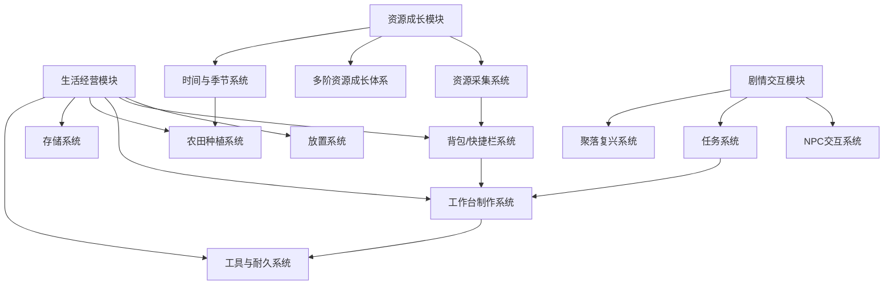
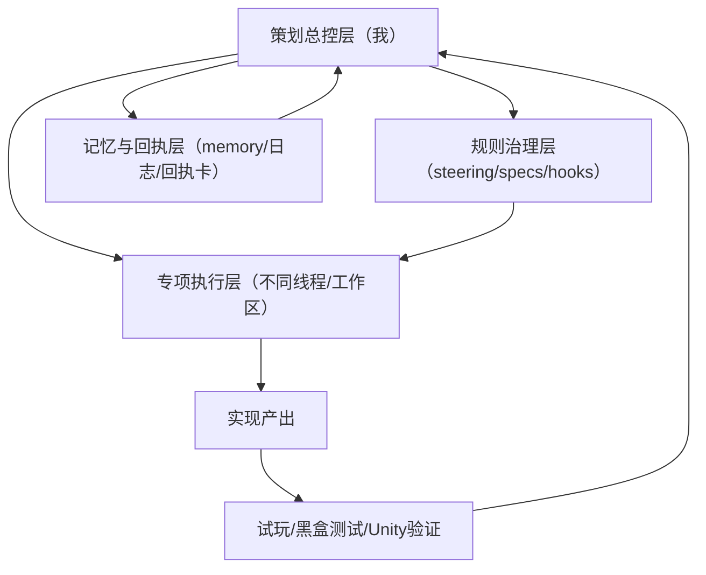

# 《Sunset》游戏策划案（V1.0正式版）

> 文档定位：面试展示版工业策划案  
> 项目名称：Sunset  
> 项目类型：Unity 6 2D 像素风奇幻生活模拟 RPG  
> 开发周期：2025.11 - 至今  
> 开发模式：本人主导策划、设计、需求拆解、规则收口与验收推进，多智能体 AI 协同完成技术落地  
> 说明：本文只写工程内可验证事实。对效率提升、返工率降低等内容，如当前工程未建立统一工时统计，则不写虚构倍数，只描述真实流程变化与提效方向。

## 一、项目总览

### 1.1 基本信息

`Sunset` 是一个基于 Unity 6 开发的 2D 像素风奇幻生活模拟 RPG。项目以“失忆工匠流落废弃聚落，通过采集、制作、建造逐步复兴聚落并找回记忆”为叙事核心，围绕生活经营、资源成长、剧情交互三大模块推进。

项目当前已经打通可游玩的基础闭环：资源积累 -> 经营生产 -> 能力成长 -> 事件/探索解锁 -> 聚落复兴反哺，并完成 spring-day1 验证切片与多套策划生产工具链搭建。

### 1.2 核心设计理念

项目参考《星露谷物语》的时间季节、资源成长、劳动反馈与高频交互逻辑，但不做直接照搬，而是在现有素材体量与个人项目研发条件下，优先做三件事：

1. 把成熟生活模拟循环拆成可逐步验证的模块化底座。
2. 把“生活感”落到具体规则边界，而不是只停在题材表面。
3. 把单人开发最容易失控的需求漂移、交互冲突与重复配置成本，提前转化为规则、工具与验收体系。

差异化不在于大世界规模，而在于“策划主导的工业化推进方式”：系统边界先收口，批量生产工具先铺好，AI 协同受规则约束后再进入实现。

### 1.3 目标用户与核心体验

- 目标用户：喜欢生活模拟、采集制作、轻经营成长与事件驱动探索的玩家。
- 核心体验关键词：稳定经营、明确成长、持续解锁、交互顺手、聚落逐步复苏。
- 体验重心：
  - 前期通过资源与制作建立“从零开始”的掌控感。
  - 中期通过工具、工作台、农田、存储等系统建立经营节奏。
  - 后续通过事件、剧情、聚落反哺建立长期目标感。

### 1.4 核心玩法循环图

- 资源采集：建立基础劳动反馈。
- 背包/存储管理：承接资源流转与操作成本。
- 工作台制作：把资源转为更高阶产出与成长入口。
- 工具与能力成长：提供效率提升与门槛解锁。
- 事件/探索解锁：提供阶段目标与叙事推进。
- 聚落复兴反馈：把成长结果回流到世界变化与新内容开放。

### 1.5 项目核心亮点

1. 策划主导的多智能体 AI 协同开发体系  
不是把 AI 当代码生成器，而是以策划需求方身份，通过 steering、hooks、specs、分层 memory、skills、本地日志与回执机制，组织多线程协作、约束产出边界、做回归与纠偏。

2. 自研 Unity 策划专属生产工具链  
围绕物品数据、配方、世界物件、Tilemap 资产、三向动画、批量层级与动画过渡配置，建立 Editor 工具链，把内容扩张从逐个手填改成批量生产。

3. 完整的交互规则收口与体验打磨体系  
放置、导航、背包、快捷栏、工作台、农田、存储等系统不是各写各的，而是围绕状态优先级、交互边界和异常回归做统一收口。

4. 可扩展的模块化系统架构  
时间季节、物品数据、工作台、剧情引导、放置规则、存档恢复等高耦合模块先统一边界与验收口径，再推进内容层扩张。

💡 面试展开点  
- 为什么个人项目反而先做规则和工具，不先堆内容。  
- 为什么 AI 协同在这个项目里不是“会用工具”，而是“会组织生产”。  

## 二、世界观与叙事设计

### 2.1 核心世界观设定

玩家扮演一名失忆工匠，在陌生而衰败的聚落中醒来。聚落的衰落不是单纯背景板，而是整个经营、建造、探索与叙事的共同起点。玩家通过采集资源、恢复生产、解锁设施、与 NPC 建立连接，逐步让聚落恢复功能，并在这一过程中追索自身记忆。

### 2.2 主线叙事脉络：失忆工匠的聚落复兴之路

当前主线以 spring-day1 验证切片为叙事入口，核心作用不是讲完故事，而是验证“剧情引导是否能驱动玩家进入经营循环”。因此，叙事优先承担以下任务：

1. 给玩家明确的初始身份和行动理由。
2. 用可操作目标把玩家引入工作台、资源、制作、交互等核心系统。
3. 把“复兴聚落”从一句设定变成持续可见的目标方向。

### 2.3 叙事与玩法的深度绑定逻辑

本项目的叙事不是独立演出层，而是玩法推进器。

- 剧情任务负责把玩家第一次带进工作台、制作、交互提示与基础资源循环。
- 聚落复兴目标为设施解锁、资源产出、成长曲线提供长期理由。
- 物品、工作台、钥匙/锁箱等规则，让探索与经营不再割裂，而是围绕“复兴进度”产生反馈。

也就是说，叙事在这里承担的是“玩法起点组织”和“长期目标赋义”，而不是单独讲故事。

### 2.4 叙事节奏规划

- 开场：通过失忆与聚落废墟建立生存与修复动机。
- 前期：通过 spring-day1 切片完成新手引导、基础制作与目标建立。
- 中期：围绕工作台升级、资源成长、设施开放推进经营节奏。
- 长期：通过探索、事件与聚落变化反哺主线推进。

💡 面试展开点  
- 为什么 spring-day1 先做“可验证引导切片”，而不是大而全主线。  
- 如何判断一段叙事是在服务玩法，而不是与玩法“两张皮”。  

## 三、全系统架构设计

### 3.1 系统总架构图

当前架构的核心不是“系统数量多”，而是三件事：

1. 数据驱动：物品、配方、工作台、时间季节、资源状态尽量以数据资产组织。
2. 边界先行：高耦合系统先统一规则边界，再推进内容制作。
3. 可回归：每个关键交互链路都要能被测试、复盘与再次验证。

### 3.2 生活经营模块

#### 3.2.1 放置系统

- 设计目标：让树苗、箱子、工作台等可放置物的预览、导航、落地、遮挡与后续交互形成一体化体验。
- 核心规则：
  - 以 `PlacementManager` 为核心，统一处理放置状态流转。
  - 当前工程围绕四态流转组织放置过程，并把放置合法性、遮挡、导航与占位判断串成同一链路。
  - `PlacementValidator` 负责耕地限制、箱子占位、碰撞边界等校验。
- 完整流程：
  - 选择可放置物 -> 进入预览态 -> 计算目标格与合法性 -> 必要时导航接近 -> 达到可放置距离后执行落地 -> 写入世界对象并纳入后续交互/存档体系。
- 交互设计：
  - 放置不是简单点击生成，而是与玩家移动、目的地、碰撞边界和预览反馈绑定。
  - 箱子与树苗的放置距离、玩家站位与物体 collider 关系是重点体验项。
- 异常处理：
  - 已针对幽灵占位、成功放置但未显示、导航抵达判定与可放置距离不一致等问题持续收口。
- 验收标准：
  - 放置结果与玩家肉眼理解一致。
  - 放置后对象能被后续交互、存档和场景遮挡规则正确接管。
- 设计思考：
  - 放置系统是多个系统的交汇点，必须用统一状态机而不是散落判断。

#### 3.2.2 背包与快捷栏系统

- 设计目标：让携带、使用、装备、拖拽、保护态锁定与热键切换形成一致行为。
- 核心规则：
  - 当前项目采用 `36 + 12` 的背包 / Hotbar 同源设计。
  - `InventoryService` 与 `HotbarSelectionService` 共同承担数据与选中态管理。
  - `GameInputManager` 统一工具、放置、农具与快捷栏输入路由。
- 交互设计：
  - 快捷栏切换、滚轮、热键、工具交互必须走统一入口。
  - 处于工具使用或关键交互状态时，对背包改动、手持物交换、快捷栏切换做保护与缓存。
- 异常处理：
  - 已针对双选框、错误交换、保护态下不合理抖动锁定等问题持续纠偏。
- 验收标准：
  - 玩家感知到的是“当前手持逻辑始终唯一且可预测”。

#### 3.2.3 工作台制作系统

- 设计目标：把资源消耗、配方、制作时间、工作台类型与主线引导串成经营核心。
- 核心规则：
  - `RecipeData` 描述产物、材料、制作时间、解锁状态与制作设施。
  - 工作台入口不仅承担制作功能，还承担新手引导与剧情推进。
  - spring-day1 中已围绕工作台建立首次交互提示、距离判定、浮层引导与 UI 显示切换。
- 交互设计：
  - 玩家第一次接触工作台时，需要得到明确但不过度打断的引导。
  - 交互距离与 UI 消失距离分层处理，避免“玩家没走远却突然关闭”的违和感。
- 异常处理：
  - 已重点围绕工作台上下遮挡、距离误判、提示仅触发一次、Overlay 接管真实 UI 的逻辑做收口。
- 验收标准：
  - 第一次工作台体验应能稳定把玩家导入制作循环。

#### 3.2.4 农田种植系统

- 设计目标：让耕地、播种、浇水、成长、季节限制与收获形成生活模拟的长期生产线。
- 核心规则：
  - 农田采用三层农田 `1 + 8` 素材逻辑组织表现与状态。
  - 农具行为与放置态、工具态、Hotbar 态联动，不允许系统各自定义工具边界。
  - `LayerTilemaps` 与农田相关校验共同承接场景格层、可耕作状态与表现分层。
- 当前状态：
  - 农田核心链路已进入工程体系并完成多轮边界修复，后续仍会继续补强内容与表现层。

#### 3.2.5 存储系统

- 设计目标：让箱子既是可放置世界对象，又是可持续存取的经营节点。
- 核心规则：
  - 箱子既要处理世界放置占位，也要处理内部存储数据、UI 打开与存档恢复。
  - 工程中已存在 `ChestController` 及对应放置/恢复验证逻辑。
- 交互设计：
  - 玩家对“箱子已经放下并能正确存取”的感知，必须与世界表现和 UI 状态一致。
- 验收标准：
  - 放置后可交互、可存取、可保存恢复，且 UI 打开对象正确绑定当前箱子。

#### 3.2.6 工具与耐久系统

- 设计目标：让工具不只是动作入口，而是经营效率、消耗与成长门槛的一部分。
- 核心规则：
  - `ToolData` 承担工具类型、品质、材料等级、精力消耗、伤害与可用行为配置。
  - 运行时围绕工具使用、精力消耗、耐久反馈、破损提示与工具锁定态组织行为。
- 工程落地：
  - `PlayerToolHitEmitter` 会结合当前工具数据决定行为类型、精力消耗和命中派发。
  - `PlayerToolFeedbackService` 处理破损、空壶等反馈。
- 当前重点：
  - 工具系统已不再只是“播放动画”，而是与数据、反馈、资源节点、农具行为联动。

### 3.3 资源成长模块

#### 3.3.1 资源采集系统

- 设计目标：建立玩家劳动行为的直接反馈来源。
- 工程落地：
  - 资源节点与工具命中由 `PlayerToolHitEmitter` 和对应资源节点脚本协作完成。
  - 不同工具类型、材料等级与资源节点之间存在明确适配关系。
- 设计思考：
  - 采集系统既是资源入口，也是工具成长和经营扩张的前置门槛。

#### 3.3.2 多阶资源成长体系

- 设计目标：让资源、工具、工作台和经营推进形成层层解锁关系。
- 当前规则：
  - 项目已建立多阶资源成长、工具等级门槛与工作台成长曲线。
  - 锁箱/钥匙的概率消耗机制也服务于经营与探索的风险收益设计。

#### 3.3.3 时间与季节系统

- 设计目标：把生活模拟的节奏感、作物规则、环境表现与长期经营周期统一起来。
- 工程落地：
  - `TimeManager` 负责分钟、小时、天、事件派发与睡眠推进。
  - `SeasonManager` 负责四季循环与阶段切换。
  - 当前已形成“四季五阶段”的时间季节框架，并对跨季植被渐变、日夜表现与环境反馈做支撑。
- 设计思考：
  - 时间系统不是单独计时器，而是多个玩法系统共同的驱动层。

### 3.4 剧情交互模块

#### 3.4.1 NPC 交互系统

- 设计目标：通过对话、交互提示与剧情触发，把经营行为和人物关系串起来。
- 工程证据：
  - 当前工程存在 `DialogueManager`、`DialogueUI`、NPC 对话调试菜单与关系调试菜单。
  - 说明 NPC 交互已具备基础对话、调试、阶段验证入口。
- 当前状态：
  - 当前更重视的是 NPC 交互作为主线推进与聚落氛围承载，而不是堆大量角色内容。

#### 3.4.2 任务系统

- 设计目标：把复杂需求拆成玩家可理解、团队可执行、AI 可实现的验证路径。
- 工程落地：
  - spring-day1 是当前最核心的验证切片。
  - 我将剧情、玩法、教学混合需求重组为“基础设施 -> 扩展改造 -> 内容配置”三层执行结构。
- 设计思考：
  - 任务系统的核心不是任务条目多，而是推进顺序必须可验证、可回归、可复制。

#### 3.4.3 聚落复兴系统

- 设计目标：把所有成长结果最终回流到聚落状态变化与长期目标推进。
- 当前状态：
  - 项目叙事和系统设计都以聚落复兴为长期轴心。
  - 当前已完成玩法底座与验证切片，后续复兴表现和阶段内容会持续在此基础上扩展。

💡 面试展开点  
- 为什么我把系统设计的重点放在“边界和流转”，不是放在“名词数量”。  
- spring-day1 为什么能体现执行策划能力，而不只是剧情 demo。  

## 四、交互体验与规则收口体系

### 4.1 核心交互链路总表

| 链路 | 关键系统 | 关键问题 |
|---|---|---|
| 放置 | PlacementManager / PlacementValidator | 预览、导航、遮挡、占位、落地一致性 |
| 背包 | InventoryService / Inventory UI | 拖拽、堆叠、保护态、装备唯一性 |
| 快捷栏 | HotbarSelectionService / GameInputManager | 热键、滚轮、工具态、放置态切换 |
| 采集 | PlayerToolHitEmitter / ToolData | 命中合法性、工具适配、精力/耐久反馈 |
| 制作 | RecipeData / CraftingStationInteractable | 设施条件、引导、距离判定、UI 接管 |
| 存储 | ChestController / Inventory UI | 放置物世界身份与存储 UI 绑定 |

### 4.2 全局状态流转规则

项目里多个交互系统的共同问题，不是“功能有没有”，而是“状态会不会打架”。因此我在推进中优先做的是全局状态优先级与中断条件收口。

当前收口重点包括：

1. 工具使用中，快捷栏与背包改动的保护态逻辑。
2. 放置态、工具态、农具态、普通交互态之间的优先级。
3. 导航抵达判定与可交互距离判定的一致性。
4. 工作台、箱子、放置物等世界对象在 UI 打开时的唯一接管关系。
5. 新手引导态与正常交互态之间的切换边界。

### 4.3 已收口的高频边界异常类型

当前项目已持续围绕 20+ 项高频交互边界问题做修复与规则定义，典型问题类型包括：

1. 放置成功但视觉未正确落地，形成“幽灵占位”。
2. 箱子放置时导航与可放置距离标准不一致。
3. 关闭背包后出现 Toolbar 双选中状态。
4. 手持物保护态边界不清，导致不该锁的情况也被锁住。
5. 工具精力消耗、耐久显示与实际使用脱节。
6. 箱子无法正常存放物品，导致后续交互链路无法验证。
7. 工作台 UI 打开/关闭距离与玩家肉眼理解不一致。
8. 玩家位于工作台上方/下方时，层级表现与交互判断不同步。
9. 首次工作台提示出现与消失时机不合理。
10. 农具行为与 Hotbar 切换、放置态切换发生冲突。

这些问题的共性不是“代码写错一行”，而是多个系统对同一交互没有统一规则。因此本项目的执行重点始终是“先定义规则，再推动返工”。

### 4.4 体验打磨原则与验收标准

当前项目的体验验收原则：

1. 玩家看到的结果必须和规则定义一致。
2. 玩家肉眼判断应尽量与程序判定一致，避免“系统觉得对，玩家觉得怪”。
3. 关键交互一旦进入保护态，反馈必须明确，不能偷偷吞输入。
4. 首次体验链路要优先保证可理解性，而不是信息堆砌。
5. 每次返工不只修现象，还要补规则口径，避免同类问题反复出现。

💡 面试展开点  
- 我如何判断一个问题是“实现 bug”，还是“规则没收口”。  
- 为什么执行策划的价值不只在提需求，更在持续收口体验边界。  

## 五、数值框架设计

### 5.1 基础数值体系

- 背包容量：采用 `36 + 12` 的背包 / 快捷栏同源方案。
- 时间节奏：采用四季五阶段的时间季节体系。
- 工具消耗：围绕 `ToolData` 配置工具精力与耐久相关参数。

### 5.2 成长数值体系

- 工具等级与材料等级共同构成资源门槛。
- 工作台等级与配方开放承担经营成长节奏。
- 多阶资源成长与设施升级共同构成长期推进曲线。

### 5.3 概率数值体系

- 锁箱与钥匙消耗机制已纳入风险收益设计。
- 概率机制的目标不是随机本身，而是增强探索与经营选择的权衡。

### 5.4 数值校验方法与平衡原则

- 先保证规则闭环，再做细化平衡。
- 先验证“能否稳定驱动循环”，再调整具体收益。
- 对关键消耗与门槛优先采用数据驱动，避免硬编码散落在多个系统。

💡 面试展开点  
- 为什么个人项目阶段先验证“数值结构是否成立”，而不是一开始就磨小数点。  

## 六、Unity 策划侧落地与工具链体系

### 6.1 策划侧全链路落地流程

我在项目中的 Unity 策划侧工作不是“会点 Inspector”，而是完整负责从需求到数据到资产再到场景验证的落地链路：

需求定义 -> 物品/配方/SO 规划 -> 批量生成或修改数据资产 -> 生成 World Prefab / 动画控制器等玩法资产 -> Tilemap 场景搭建与分层绘制 -> 工具与玩家动画接线 -> 进 Unity 试玩、观察手感、定位边界问题 -> 返工规则收口。

这个链路的关键在于，策划不是只写文档，而是直接把内容生产方式设计出来，避免项目死在重复配置与低效试错上。

### 6.2 自研策划工具链详解

#### 数据生产工具链

1. `Tool_BatchItemSOGenerator`
   - 设计背景：物品种类持续扩张时，逐个手建 SO、填 ID、定路径、分类与通用参数成本过高。
   - 解决痛点：把工具、武器、种子、作物、树苗、工作台、存储、材料、消耗品等数据资产的建立流程标准化。
   - 功能实现：支持大类/小类分层、起始 ID、输出目录、批量公共属性、图标顺序、数据路径规范。
   - 策划价值：把“新增一批物品”从纯手工配置改成规则化生产。

2. `Tool_BatchItemSOModifier`
   - 设计背景：内容迭代中，经常需要跨多个 SO 统一改字段。
   - 解决痛点：避免手动逐个点开资产，降低批量改错风险。
   - 功能实现：基于 SerializedProperty 反射自动发现共有字段，按 LCA 类型与 Header 分组批量修改。
   - 策划价值：适合中后期数据口径调整与规则统一。

3. `Tool_BatchRecipeCreator`
   - 设计背景：制作系统推进后，配方数量增加明显。
   - 解决痛点：逐个新建 RecipeData、逐格填材料组合效率低。
   - 功能实现：以接近表格的方式批量录入产物、材料、制作设施、制作时间与经验。
   - 策划价值：把“设计配方”与“落地配方资产”之间的转换成本降下来。

#### 资产生产工具链

1. `WorldPrefabGeneratorTool`
   - 设计背景：ItemData 与世界中可拾取/可掉落对象之间需要持续转化。
   - 解决痛点：图标资源转世界物件预制体时，缩放、阴影、旋转、目录结构容易重复劳动。
   - 功能实现：从 ItemData 图标批量生成 World Prefab，支持路径镜像、阴影参数、缩放与旋转配置。
   - 策划价值：让物品数据更快进入实际玩法世界。

2. `TilemapToSprite`
   - 设计背景：部分建筑、场景结构先以 Tilemap 搭建，再转成 Sprite/Prefab 资产使用。
   - 解决痛点：避免反复手工截图、裁边、导出。
   - 功能实现：支持多 Tilemap 合并、空白裁剪、透明背景、边距控制与导出 Sprite。
   - 策划价值：打通“场景拼装素材”和“可复用玩法资产”之间的转换。

#### 动画生产工具链

1. `ToolAnimationPipeline`
   - 设计背景：工具动画、三向动作、Aseprite 素材切片与控制器生成在个人项目中如果全手工维护，极易出错。
   - 解决痛点：切片、重命名、Pivot 同步、动画剪辑生成、控制器生成等流程分散且重复。
   - 功能实现：把自动切片、规范命名、Pivot 继承、动画生成、控制器生成串成一条流水线。

2. `LayerAnimSetupTool`
   - 设计背景：玩家动作、手部层、工具层需要稳定同步。
   - 解决痛点：手动逐方向建立动画与对齐 Pivot 成本高，且容易不一致。
   - 功能实现：自动扫描方向、读取 Aseprite 源文件 Pivot、批量生成对应动画。

3. `SliceAnimControllerTool`
   - 设计背景：不同工具类型、品质、方向共用控制器时，手工建状态机会迅速膨胀。
   - 解决痛点：统一参数、方向和品质状态的控制器维护成本高。
   - 功能实现：扫描动画命名，按 `State / Direction / ToolType / ToolQuality` 生成控制器。

4. `Tool_003_BatchAnimTransitions`、`Tool_001_BatchProject`、`Tool_002_BatchHierarchy`
   - 设计背景：场景资源、动画过渡、层级结构的批量调节在内容扩张阶段频繁出现。
   - 解决痛点：减少重复点选与层级整理的机械劳动。

> 当前工程未建立统一工时统计，因此这里不写“提升多少倍”。但工程事实可以明确证明：这些工具已经把多类内容生产从“逐个手工点击”转成了“规则化批量处理”。

### 6.3 数据资产规范

项目中围绕工具链同步形成了多套策划侧资产规范：

- 物品 SO 分类与 ID 规划规范。
- RecipeData 产物/材料/设施口径规范。
- World Prefab 输出路径与目录镜像规范。
- 动画命名规范：动作、方向、工具类型、品质参数统一。
- Tilemap 转资产时的导出边界、透明背景与裁剪规则。

这些规范的价值在于：当内容规模扩大时，数据、动画、预制体仍能被工具识别和继续加工，而不会变成一次性手工产物。

### 6.4 跨岗位协作效率提升方案

虽然这是个人项目，但我在设计工具链时有明确的团队协作视角：

1. 用数据资产规范降低程序理解策划意图的成本。
2. 用批量工具减少美术素材进入玩法资产的转换损耗。
3. 用统一命名与控制器参数减少动画接线歧义。
4. 用 Editor 工具和日志化流程，把需求改动转成可重复执行的动作，而不是口头说明。

💡 面试展开点  
- 为什么我认为“策划自建工具链”是执行策划价值的一部分。  
- 如何区分“会用 Unity”与“能组织内容工业化生产”。  

## 七、AI 原生策划与多智能体协同开发体系

### 7.1 设计背景：单人开发的核心痛点

个人项目在接入 AI 后，并不会自然变快，反而会暴露三类问题：

1. 需求漂移：描述不稳，AI 每轮理解都在变。
2. 逻辑漂移：局部修好了，全局规则又被破坏。
3. 实现漂移：生成结果看似完成，实机体验却不成立。

如果没有治理体系，AI 只会把这些问题放大。

### 7.2 多智能体协同架构总览

本项目采用的是“策划主控”的多线程协作架构，而不是放任多个模型自由输出。

我的角色不是“提一句需求等结果”，而是：

- 负责拆线程、定目标、定优先级。
- 负责把模糊想法转成有约束的策划指令。
- 负责做认知对齐、结果审阅、回归测试与返工裁定。

### 7.3 核心协作规范体系

#### steering

- 作用：承担项目级执行口径、工作方式、输出规范与高优先级规则。
- 价值：让不同线程在进入具体任务前先对齐同一套项目规则，而不是各说各话。

#### hooks

- 作用：在 promptSubmit、agentStop 等关键节点自动触发规则路由、memory 检查与治理动作。
- 工程证据：
  - `smart-assistant.kiro.hook` 会按用户意图自动加载对应领域规则。
  - `memory-update-check.kiro.hook` 负责在停止时检查 memory 与继承快照。
- 价值：把“记得做”变成“自动触发”，降低协作走样概率。

#### specs

- 作用：把治理、批次分发、典狱长/看守长模式、thread-state、live 基线等规则落成正式文档。
- 价值：让不同线程面对同类场景时，能复用统一流程，而不是重新口头解释。

#### 分层 memory

- 作用：把线程记忆、工作区记忆、父子层承接与历史卷分离管理。
- 价值：在长周期项目里保持上下文连续性，避免“换个线程就从零解释”。

#### skills 本地化与注册治理

- 作用：不是只装通用 skill，而是把 `sunset-workspace-router`、`sunset-scene-audit`、`sunset-review-router`、`sunset-unity-validation-loop` 等能力本地化到项目语境中。
- 价值：让 skill 真正服务当前项目，而不是停在通用模板层。

### 7.4 标准化开发流程

本项目当前沉淀出的标准化 AI 辅助策划流程为：

1. 需求定义  
我先用大白话长文本明确场景、问题、异常现象、预期边界与不接受的结果。

2. 认知对齐  
要求线程先复述理解、回读必要文档、确认影响范围，而不是直接动手。

3. 初稿产出  
让 AI 基于已有规则与文档产出方案、实现或拆解结果。

4. 规则收口  
我根据试玩与观察结果，继续收紧边界、修正规则、裁定是否返工。

5. 验收回归  
通过黑盒测试、Unity 辅助验证、回执卡与日志留痕，确认这轮是否真正闭环。

### 7.5 核心治理机制

#### 典狱长总控模式

- 作用：不是收到回执就继续发，而是先审回执，再判线程属于“继续发 / 停给用户验收 / 停给用户分析 / 无需继续发”哪一类。
- 价值：把多线程推进从“机械续工”变成“先判断是否该继续”。

#### 多线程分工与批次分发

- 作用：把不同问题拆给不同线程，各自领取专属 prompt 与固定回收卡。
- 价值：降低长上下文污染，让每条线程围绕单一切片推进。

#### 回执卡、保底六点卡、停发裁定

- 作用：统一线程回收格式与用户可读汇报格式。
- 价值：避免线程只交技术 dump，不交“做到哪了、还差什么、下一步是什么”。

#### 漂移纠偏体系

- 理解漂移：先让 AI 复述和读文档，避免一上来就写错方向。
- 逻辑漂移：通过规则文档、状态边界和反复试玩发现“看起来对、实际不对”的问题。
- 实现漂移：结合 Unity 验证、黑盒测试和回执审查，确认功能不是纸面成立。

### 7.6 工具集成：Unity MCP 辅助验证流程

Unity MCP 在本项目里不是炫技点，而是辅助验证手段。

- 用途：
  - 读取活动场景、层级、Console 等现场信息。
  - 在基线正常时辅助做只读验证与部分 live 证据获取。
- 治理要点：
  - 已将 `unityMCP + 8888` 沉淀为唯一有效 live 基线。
  - 明确区分“配置层错误”和“旧会话缓存未刷新”。
- 策划价值：
  - 帮助我更快确认实现是否接近需求，但最终体验判断仍由我通过试玩完成。

### 7.7 效果验证

当前工程没有统一工时看板，因此不虚构“效率提升多少倍”。

但已经可以明确验证的效果包括：

1. AI 协作已从单轮对话，升级为多线程、可回收、可复盘的治理流程。
2. 多个关键规则已经从“口头提醒”沉淀为 steering、specs、hooks 与 skill 体系。
3. Unity MCP、日志、回执、记忆链路已经形成可追溯证据，而不是一次性临时说明。
4. 项目中的复杂问题，不再只靠“继续试试”，而是先判断属于理解、逻辑还是实现漂移。

### 7.8 可复用方法论沉淀与团队适配方案

这套方法论未来进入团队后可复用的不是具体文件名，而是三个原则：

1. 策划必须掌握 AI 协作的主控权，而不是把需求外包给 AI。
2. 任何多线程协作都要有统一规则、记忆分层、回执和停发机制。
3. AI 协同一定要接入试玩、黑盒测试与最终体验验收，不能只停在“生成结果像是完成了”。

💡 面试展开点  
- 我为什么坚持用大白话长文本，而不是迷信复杂 Prompt 工程。  
- 如何区分“AI 帮我开发”与“我组织 AI 为项目开发服务”。  

## 八、项目开发与迭代管理

### 8.1 整体开发阶段划分与里程碑

- 阶段一：确定生活模拟 RPG 核心定位与玩法底座。
- 阶段二：搭建时间季节、物品数据、背包、工作台、放置等核心系统。
- 阶段三：以 spring-day1 为验证切片，重组剧情、玩法、教学混合需求。
- 阶段四：围绕交互边界、AI 协同规范与工具链持续收口。

### 8.2 spring-day1 验证切片完整拆解

我没有把 day1 当成“写一些剧情文本”，而是拆成三层执行结构：

1. 基础设施层  
先保证工作台、交互、距离判定、UI 入口、基础剧情触发能跑通。

2. 扩展改造层  
把已有系统改造为能支撑 day1 的实际游玩链路。

3. 内容配置层  
最后再补剧情文本、提示内容、引导呈现与验证细节。

这样做的原因是：没有底座就先堆内容，只会加速返工。

### 8.3 需求管理与迭代流程

- 先做需求降维拆解，再给 AI 和工程执行。
- 每轮都要求有明确验收口径。
- 试玩发现问题后，优先判断规则是否失真，而不是只追代码现象。

### 8.4 问题复盘与持续优化机制

- 通过 memory、回执、治理文档和 skill-trigger-log 保留决策链。
- 对重复出现的问题，优先提升为规则、工具或 hook，而不是继续人工提醒。

💡 面试展开点  
- spring-day1 为什么能证明我具备执行策划入职能力。  

## 九、测试与验收体系

### 9.1 黑盒测试用例设计

当前项目黑盒测试重点聚焦三类场景：

1. 高频场景  
放置、工具使用、背包切换、工作台交互等玩家高频动作。

2. 边界场景  
快速连续点击、移动中放置、距离边缘交互、保护态切换、UI 打开关闭边界。

3. 异常场景  
存档恢复、状态中断、箱子恢复、工作台提示只出现一次、农具保护逻辑等。

### 9.2 体验验收标准

- 功能成立不等于体验成立。
- 只要玩家肉眼理解与程序判定矛盾，就仍算未过线。
- 体验终验优先由我通过试玩判断，MCP 与日志只作为辅助证据。

### 9.3 已完成测试与优化记录

当前工程已完成多轮针对放置、背包、工作台、工具、工作流治理和 MCP 基线的验证与收口；其中大量问题都已留痕到 memory、规范文档与线程回执中，具备复盘链路。

💡 面试展开点  
- 我如何通过试玩定位“AI 看不出来但玩家一玩就觉得怪”的问题。  

## 十、项目总结与未来规划

### 10.1 已完成核心成果总结

1. 完成了生活经营、资源成长、剧情交互三大模块的底层闭环搭建。
2. 完成了 spring-day1 验证切片与一系列高耦合需求的可执行拆解。
3. 建立了围绕物品、配方、世界物件、Tilemap、动画的 Unity 策划生产工具链。
4. 建立了策划主导的 AI 协同治理体系，把多线程开发纳入可约束、可回收、可纠偏流程。

### 10.2 个人能力成长与复盘

这个项目让我完成了三类能力的同时成长：

1. 从“想法很多”走到“能拆成可执行规则与验收口径”。
2. 从“会用 Unity”走到“能组织策划侧内容生产链路”。
3. 从“会用 AI”走到“能主控 AI 协同开发流程并持续纠偏”。

### 10.3 后续扩展方向与规划

- 继续扩展聚落复兴的长期反馈与设施成长。
- 继续补强农田、资源成长与剧情事件的中后期内容层。
- 继续将高频返工点沉淀为更稳定的工具、规则与自动验证入口。

💡 面试展开点  
- 如果进入团队，我会把 Sunset 里沉淀出的哪些方法迁移到真实项目流程中。  

## 附录

### 附录1：当前工程中可直接指认的核心脚本 / 工具样本

- `Assets/YYY_Scripts/Service/Placement/PlacementManager.cs`
- `Assets/YYY_Scripts/Controller/Input/GameInputManager.cs`
- `Assets/YYY_Scripts/Anim/Player/PlayerAnimController.cs`
- `Assets/YYY_Scripts/Anim/Player/PlayerToolController.cs`
- `Assets/YYY_Scripts/Combat/PlayerToolHitEmitter.cs`
- `Assets/YYY_Scripts/Service/TimeManager.cs`
- `Assets/YYY_Scripts/Service/SeasonManager.cs`
- `Assets/YYY_Scripts/Story/Interaction/CraftingStationInteractable.cs`
- `Assets/Editor/Tool_BatchItemSOGenerator.cs`
- `Assets/Editor/Tool_BatchItemSOModifier.cs`
- `Assets/Editor/Tool_BatchRecipeCreator.cs`
- `Assets/Editor/WorldPrefabGeneratorTool.cs`
- `Assets/Editor/TilemapToSprite.cs`
- `Assets/Editor/ToolAnimationPipeline.cs`
- `Assets/Editor/LayerAnimSetupTool.cs`
- `Assets/Editor/SliceAnimControllerTool.cs`

### 附录2：AI 协同治理样本入口

- `.kiro/hooks/smart-assistant.kiro.hook`
- `.kiro/hooks/memory-update-check.kiro.hook`
- `.kiro/specs/Codex规则落地/治理线程批次分发与回执规范.md`
- `.kiro/specs/Codex规则落地/典狱长模式_治理总闸与分发规范.md`
- `.kiro/specs/Steering规则区优化/当前运行基线与开发规则/Sunset当前规范快照_2026-03-22.md`

### 附录3：面试使用建议

面试时建议优先展开四块内容：

1. spring-day1 为什么能体现执行策划能力。
2. 放置/背包/工作台为什么要做规则收口。
3. 为什么我在 Unity 里先做工具链，而不是纯手工堆内容。
4. 为什么我的 AI 协同是“主控生产流程”，不是“会写 prompt”。
