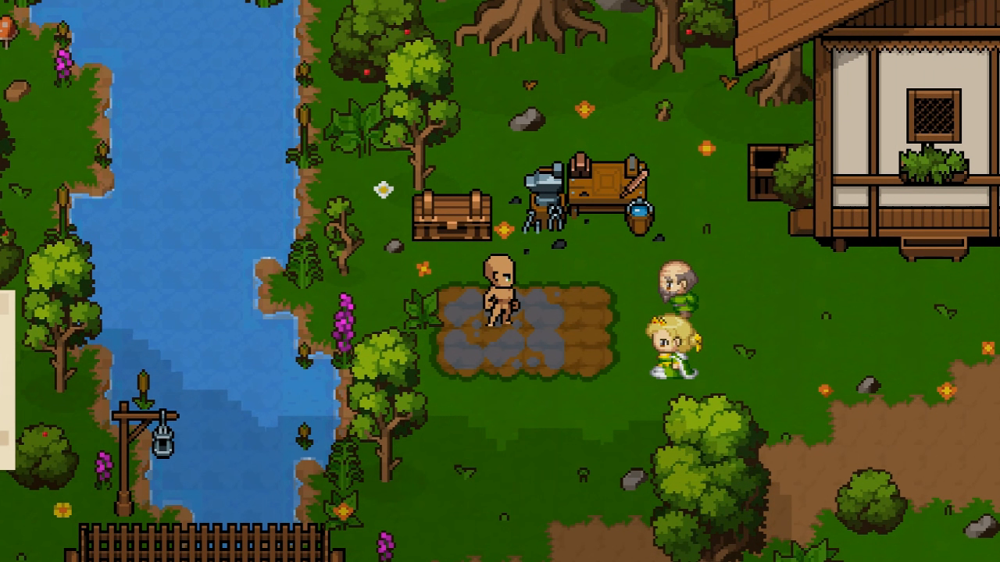
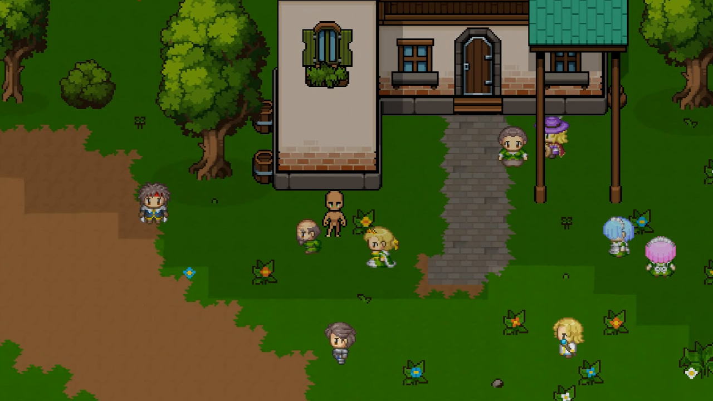

# Sunset

> 一个以“失忆工匠在残破聚落里重新活下来”为起点的 2D 像素奇幻生活模拟 RPG。
> 当前已经可以完整玩完主角来到这里的第一天。

  <a href="https://www.bilibili.com/video/BV16Ed1BAEun/">完整演示视频</a> ·
  <a href="#day1-现在能玩到什么">当前可玩内容</a> ·
  <a href="#这个世界接下来会往哪里长">后续方向</a>

## 这是什么样的一款游戏

《Sunset》的主角是一名失忆工匠。
他在危险边缘被人救起，被带进一个勉强维持运转的村子，在陌生的目光、临时落脚的旧屋和一张生锈的工作台之间，重新学会怎么活下去。

这里的“生活模拟”不是把种地、砍树、做东西并排摆出来，而是把它们都变成同一件事的一部分：

- 你要先留下来。
- 你要先证明自己能劳动、能制作、能帮上忙。
- 你也会在一次次劳动、制作和相处里，慢慢拼回自己的过去。

当前版本最核心的内容，是已经把这件事做成了完整可玩的 Day1。

| 当前阶段 | 内容 |
| --- | --- |
| 当前可玩内容 | Day1 |
| 当前可玩场景 | 村庄 / 采集区 / 旧屋 |
| 体验关键词 | 劳动、制作、耕种、记忆、冲突、夜晚自由活动 |
| 演示入口 | [Bilibili 实录视频](https://www.bilibili.com/video/BV16Ed1BAEun/) |

## Day1 现在能玩到什么

这一天已经不再是几个零散功能的串场，而是一条能完整走下来的第一天：

1. 你会在矿洞外被救起，先意识到这个世界并不安全。
2. 你会被带进村子，在围观和议论里第一次认识这里的人。
3. 你会在旧屋里接受疗伤，第一次真正看见自己的状态。
4. 你会在工作台前触发记忆闪回，重新接通最基础的制作能力。
5. 你会开垦、播种、浇水、砍树、回到工作台做出第一件东西，用一轮劳动证明自己不是白吃饭的人。
6. 傍晚回到村里后，晚饭上的冲突会让你第一次正面感受到这个聚落并不完全欢迎你。
7. 夜里你可以直接休息，也可以再去看一圈这个还没真正睡下的村子，然后结束 Day1。

这一整条线里，剧情、引导、采集、耕种、制作、时间推进和场景切换已经连成了同一段体验，而不是各玩各的。

## 你会在 Sunset 里做什么

- 在村庄、采集区和旧屋之间来回奔走，把“活下来”变成每天都要处理的真实问题。
- 砍树、采石、开垦农地、播种浇水，把资源一步步变成更稳定的生产能力。
- 使用工作台把材料转成工具、半成品和新的可能，让制作不只是菜单，而是成长本身。
- 通过记忆闪回重新找回知识与能力，让“想起什么”直接影响“你能做什么”。
- 和村民建立关系，也承受他们的试探、敌意和各自的立场，让聚落不是背景板。

当前版本里，劳动不是教程，制作也不是装饰，它们都是主角被这个地方接纳之前必须交出的答卷。

## 画面一瞥

*入村后的第一轮打量，和“先被看见、再试着留下来”的开始。*

## 为什么工作台、种地、晚饭和记忆会连在一起

因为《Sunset》想做的，不是“先讲剧情，再给玩法”，而是让剧情直接长在玩法里。

工作台第一次被摸到时，不只是解锁一个制作入口，它同时也是主角记忆恢复的起点。
第一次开垦和第一次制作，不只是教学步骤，它们是“你今天能不能靠自己的手留下来”的证明。
晚饭上的冲突也不是一段单独的对白，而是在你刚刚开始融入这个地方时，立刻把人与人之间的张力摆到面前。

所以 Day1 的重点从来不是“教会玩家所有按钮”，而是让玩家真的过完这一天。

## 这个世界接下来会往哪里长

当前 README 不会假装它已经做完所有东西，但后续方向已经很明确：

- 聚落会继续从“暂时能活”往“逐步恢复功能”推进，更多设施、秩序和日常节奏会被补起来。
- 主角会继续通过工作台、制作能力与闪回，把失去的记忆一点点拼回来。
- 矿洞与外部威胁不会只停留在开场背景，它们会继续推动后续事件与探索。
- 野外上锁宝箱会成为明确的探索博弈：你可以拿便宜但成功率低的钥匙反复尝试，也可以赌更贵、更稳的一次开锁。
- 村民关系不会只停在开场认识，后续会继续长到日常互动、立场变化和聚落生活本身。

## 演示视频

如果你只想先看完整效果，直接看这条实录：

- [个人作品《Sunset》演示实录视频_干活小曲BGM版（Bilibili）](https://www.bilibili.com/video/BV16Ed1BAEun/)

## 如何打开项目

- 推荐 Unity 版本：`6000.0.62f1`
- 直接以仓库根目录作为 Unity 项目打开
- 当前主线切片围绕 `Town`、`Primary` 和 `Home` 三个场景展开

## 深入阅读

- [项目总览与阅读地图](.kiro/about/00_项目总览与阅读地图.md)
- [系统架构与代码全景](.kiro/about/01_系统架构与代码全景.md)
- [当前状态、差异与接手指南](.kiro/about/02_当前状态、差异与接手指南.md)
- [持续策划案总索引](Docx/大总结/Sunset_持续策划案/00_总索引.md)
